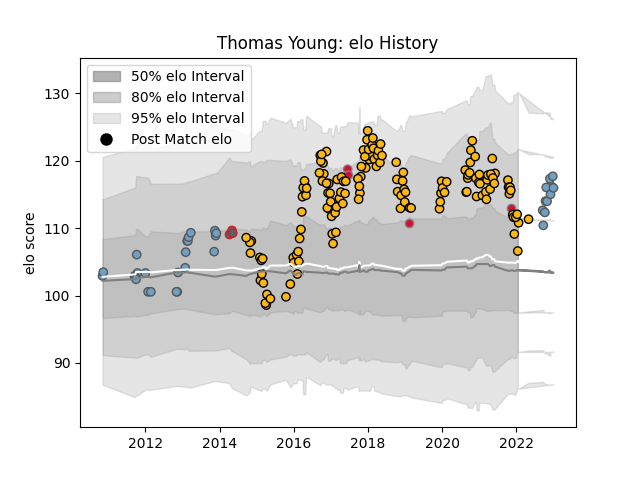

---  
layout: page  
title: Thomas Young  
date: 2022-12-09 13:22:24.554988  
categories: player  
---
# Thomas Young

## Positions: FL

## Country: Wales

## Current elo: 105.0

## Current Percentile: 82.0

# Elo History

# Match History

| Team             |   Appearances |   Win Rate |
|:-----------------|--------------:|-----------:|
| Wasps            |           146 |   0.544521 |
| Cardiff Blues    |            31 |   0.354839 |
| Wales            |             4 |   1        |
| Gloucester Rugby |             3 |   0.333333 |

| Opponent           |   Matches |   Win Rate |
|:-------------------|----------:|-----------:|
| Harlequins         |        16 |   0.375    |
| Northampton Saints |        14 |   0.642857 |
| Bath Rugby         |        13 |   0.653846 |
| Exeter Chiefs      |        12 |   0.416667 |
| Saracens           |        11 |   0.181818 |
| London Irish       |        10 |   0.9      |
| Worcester Warriors |        10 |   0.7      |
| Leicester Tigers   |        10 |   0.7      |
| Gloucester Rugby   |        10 |   0.35     |
| Sale Sharks        |         9 |   0.333333 |
| Newcastle Falcons  |         9 |   0.722222 |
| Bristol Rugby      |         9 |   0.888889 |
| Munster            |         7 |   0.142857 |
| Stade Toulousain   |         4 |   0.375    |
| Edinburgh          |         4 |   0.25     |
| Connacht           |         3 |   0.333333 |
| Ulster             |         3 |   0.333333 |
| Glasgow Warriors   |         3 |   0        |
| Toulon             |         2 |   0        |
| Scarlets           |         2 |   0.5      |
| Wasps              |         2 |   0.5      |
| Ospreys            |         2 |   0.5      |
| Zebre              |         2 |   1        |
| Leinster           |         2 |   0        |
| La Rochelle        |         2 |   0.5      |
| Benetton Treviso   |         2 |   0.25     |
| London Welsh       |         1 |   1        |
| Samoa              |         1 |   1        |
| Italy              |         1 |   1        |
| Sharks             |         1 |   1        |
| Fiji               |         1 |   1        |
| Stormers           |         1 |   1        |
| Tonga              |         1 |   1        |
| Dragons            |         1 |   1        |
| Cardiff Blues      |         1 |   0        |
| Bulls              |         1 |   0        |
| Aironi             |         1 |   1        |