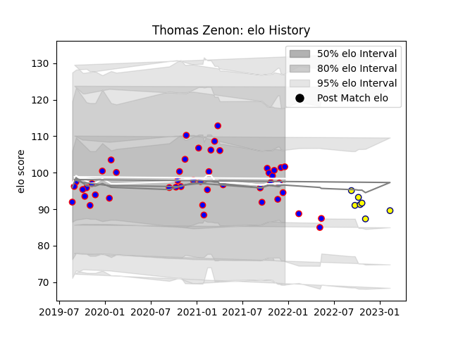

---  
layout: page  
title: Thomas Zenon  
date: 2023-02-15 22:12:21.979620  
categories: player  
---
# Thomas Zenon

## Positions: FB, W

## Current elo: 102.0

## Current Percentile: 44.0

# Elo History

# Match History

| Team    |   Appearances |   Win Rate |
|:--------|--------------:|-----------:|
| Beziers |            47 |   0.351064 |
| Nevers  |             7 |   0.428571 |

| Opponent                   |   Matches |   Win Rate |
|:---------------------------|----------:|-----------:|
| Vannes                     |         5 |   0        |
| Rouen                      |         5 |   0.6      |
| Colomiers                  |         5 |   0.2      |
| Oyonnax                    |         4 |   0.25     |
| Provence Rugby             |         4 |   0.5      |
| Aurillac                   |         4 |   0.75     |
| Grenoble                   |         4 |   0.25     |
| Perpignan                  |         3 |   0.333333 |
| Carcassonne                |         3 |   0.333333 |
| Mont-de-Marsan             |         2 |   0        |
| Montauban                  |         2 |   0.5      |
| Biarritz Olympique         |         2 |   0.5      |
| Soyaux-Angouleme           |         2 |   0        |
| Valence Romans Drome Rugby |         2 |   0.75     |
| Nevers                     |         2 |   0        |
| Massy                      |         1 |   1        |
| Narbonne                   |         1 |   1        |
| Bayonne                    |         1 |   0        |
| Roval Drome XV             |         1 |   1        |
| US Bressane                |         1 |   0        |