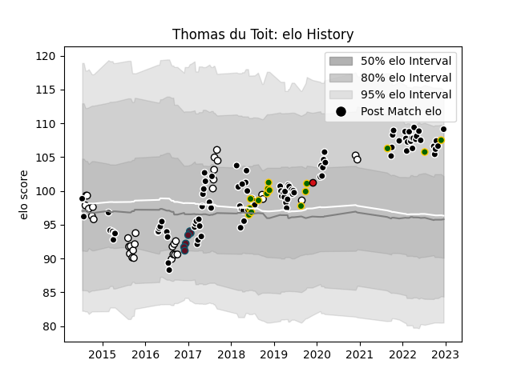

---  
layout: page  
title: Thomas du Toit  
date: 2022-12-18 16:19:25.524540  
categories: player  
---
# Thomas du Toit

## Positions: P

## Country: South Africa

## Current elo: 109.0

## Current Percentile: 85.0

# Elo History

# Match History

| Team             |   Appearances |   Win Rate |
|:-----------------|--------------:|-----------:|
| Sharks           |            96 |   0.53125  |
| Natal Sharks     |            34 |   0.661765 |
| South Africa     |            15 |   0.666667 |
| Munster          |             6 |   1        |
| Stade Toulousain |             1 |   1        |

| Opponent                 |   Matches |   Win Rate |
|:-------------------------|----------:|-----------:|
| Bulls                    |        11 |   0.272727 |
| Lions                    |        11 |   0.454545 |
| Stormers                 |        10 |   0.55     |
| Golden Lions             |         7 |   0.428571 |
| Jaguares                 |         7 |   0.571429 |
| Hurricanes               |         5 |   0.2      |
| Blue Bulls               |         5 |   0.8      |
| England                  |         5 |   0.6      |
| Griquas                  |         5 |   0.8      |
| Pumas                    |         5 |   0.8      |
| Free State Cheetahs      |         4 |   0.625    |
| Western Province         |         4 |   0.25     |
| Glasgow Warriors         |         4 |   0.75     |
| Melbourne Rebels         |         4 |   0.625    |
| Crusaders                |         4 |   0.125    |
| Argentina                |         3 |   1        |
| Queensland Reds          |         3 |   0.333333 |
| Southern Kings           |         3 |   0.666667 |
| Wales                    |         3 |   0        |
| New South Wales Waratahs |         3 |   0.833333 |
| Highlanders              |         3 |   1        |
| Eastern Province Kings   |         3 |   1        |
| Blues                    |         3 |   0.666667 |
| Connacht                 |         3 |   1        |
| Chiefs                   |         3 |   0.333333 |
| Brumbies                 |         3 |   0.333333 |
| Zebre                    |         2 |   1        |
| Benetton Treviso         |         2 |   1        |
| Dragons                  |         2 |   1        |
| Leinster                 |         2 |   0.5      |
| Western Force            |         2 |   1        |
| Cheetahs                 |         2 |   1        |
| Sunwolves                |         2 |   1        |
| Scotland                 |         1 |   1        |
| Boland Cavaliers         |         1 |   1        |
| Ulster                   |         1 |   0        |
| Bordeaux Begles          |         1 |   1        |
| France                   |         1 |   1        |
| Scarlets                 |         1 |   1        |
| Racing 92                |         1 |   1        |
| Canada                   |         1 |   1        |
| Edinburgh                |         1 |   0        |
| Ospreys                  |         1 |   1        |
| Namibia                  |         1 |   1        |
| Munster                  |         1 |   0        |
| Leicester Tigers         |         1 |   1        |
| Cardiff Blues            |         1 |   0        |