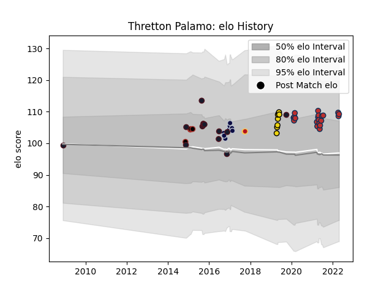

---  
layout: page  
title: Thretton Palamo  
date: 2023-03-09 10:13:16.772806  
categories: player  
---
# Thretton Palamo

## Positions: C

## Country: United States of America

## Current elo: 109.0

## Current Percentile: 77.0

# Elo History

# Match History

| Team                     |   Appearances |   Win Rate |
|:-------------------------|--------------:|-----------:|
| Old Glory DC             |            20 |   0.55     |
| United States of America |            14 |   0.142857 |
| Bristol Rugby            |            13 |   0.307692 |
| Houston SaberCats        |             8 |   0.375    |
| Saracens                 |             4 |   1        |
| Dragons                  |             2 |   0.5      |

| Opponent               |   Matches |   Win Rate |
|:-----------------------|----------:|-----------:|
| Toronto Arrows         |         3 |   0        |
| NOLA Gold              |         3 |   0.333333 |
| Rugby ATL              |         3 |   0.666667 |
| Seattle Seawolves      |         3 |   0.666667 |
| R.U. New York          |         2 |   0        |
| Northampton Saints     |         2 |   0.5      |
| Japan                  |         2 |   0        |
| Samoa                  |         2 |   0        |
| Houston SaberCats      |         2 |   1        |
| Exeter Chiefs          |         2 |   0.5      |
| Tonga                  |         2 |   0        |
| Cardiff Blues          |         2 |   0        |
| Ospreys                |         2 |   0.5      |
| Utah Warriors          |         2 |   0.5      |
| Pau                    |         2 |   1        |
| Rugby New York         |         2 |   0        |
| Russia                 |         1 |   1        |
| Austin Elite Rugby     |         1 |   1        |
| Sale Sharks            |         1 |   1        |
| Romania                |         1 |   0        |
| Scotland               |         1 |   0        |
| Southern Kings         |         1 |   1        |
| Ulster                 |         1 |   0        |
| Wasps                  |         1 |   0        |
| San Diego Legion       |         1 |   0        |
| New England Free Jacks |         1 |   1        |
| Austin Gilgronis       |         1 |   1        |
| London Welsh           |         1 |   1        |
| Leicester Tigers       |         1 |   0        |
| L. A. Giltinis         |         1 |   0        |
| Italy                  |         1 |   0        |
| Harlequins             |         1 |   0        |
| Glendale Raptors       |         1 |   1        |
| France                 |         1 |   0        |
| Fiji                   |         1 |   0        |
| Dallas Jackals         |         1 |   1        |
| Canada                 |         1 |   1        |
| Bath Rugby             |         1 |   0        |
| Australia              |         1 |   0        |
| Austin Herd            |         1 |   1        |
| Worcester Warriors     |         1 |   1        |