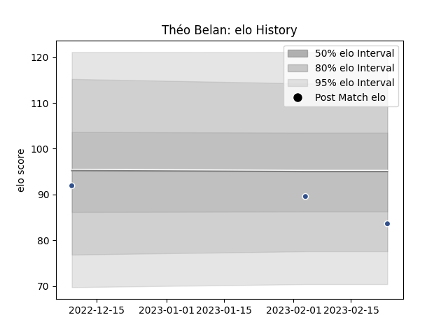

---  
layout: page  
title: Théo BELAN  
date: 2023-02-09 13:57:19.172708  
categories: player  
---
# Théo BELAN

## Positions: C

## Current elo: 102.0

## Current Percentile: 70.0

# Elo History

# Match History

| Team             |   Appearances |   Win Rate |
|:-----------------|--------------:|-----------:|
| Lyon             |            38 |   0.460526 |
| Provence Rugby   |            36 |   0.5      |
| Toulon           |            19 |   0.421053 |
| Stade Toulousain |            11 |   0.545455 |
| Agen             |             8 |   0.375    |

| Opponent                   |   Matches |   Win Rate |
|:---------------------------|----------:|-----------:|
| Racing 92                  |         8 |   0.375    |
| Grenoble                   |         7 |   0.571429 |
| Castres Olympique          |         7 |   0.428571 |
| Clermont Auvergne          |         5 |   0.2      |
| Montpellier Herault        |         5 |   0.4      |
| Bordeaux Begles            |         5 |   0.4      |
| Brive                      |         5 |   0.3      |
| Toulon                     |         5 |   0.5      |
| Aurillac                   |         4 |   0.5      |
| Montauban                  |         4 |   0.75     |
| Pau                        |         4 |   0.75     |
| La Rochelle                |         4 |   0.5      |
| Stade Francais Paris       |         4 |   0.75     |
| Carcassonne                |         4 |   0.5      |
| Stade Toulousain           |         4 |   0.5      |
| Beziers                    |         4 |   0.5      |
| Oyonnax                    |         4 |   0.25     |
| Bayonne                    |         3 |   0.5      |
| US Bressane                |         2 |   0.75     |
| Perpignan                  |         2 |   0        |
| Agen                       |         2 |   1        |
| Nevers                     |         2 |   0.5      |
| Mont-de-Marsan             |         2 |   0.5      |
| Soyaux-Angouleme           |         2 |   0.5      |
| Colomiers                  |         2 |   0.5      |
| Cardiff Blues              |         2 |   0        |
| Vannes                     |         1 |   0        |
| Valence Romans Drome Rugby |         1 |   1        |
| Narbonne                   |         1 |   0        |
| Sale Sharks                |         1 |   1        |
| Rouen                      |         1 |   1        |
| Provence Rugby             |         1 |   1        |
| Ospreys                    |         1 |   0        |
| Lyon                       |         1 |   0        |
| Biarritz Olympique         |         1 |   0.5      |
| Wasps                      |         1 |   0        |