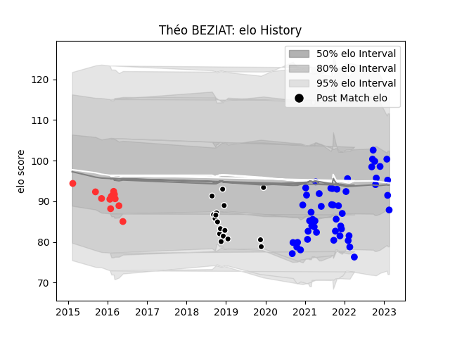

---  
layout: page  
title: Théo BEZIAT  
date: 2023-02-05 15:15:55.528157  
categories: player  
---
# Théo BEZIAT

## Positions: H

## Current elo: 108.0

## Current Percentile: 54.0

# Elo History

# Match History

| Team           |   Appearances |   Win Rate |
|:---------------|--------------:|-----------:|
| Vannes         |            49 |  0.510204  |
| Provence Rugby |            17 |  0.411765  |
| Tarbes         |            12 |  0.0833333 |

| Opponent                   |   Matches |   Win Rate |
|:---------------------------|----------:|-----------:|
| Biarritz Olympique         |         7 |   0        |
| Aurillac                   |         6 |   0.5      |
| Carcassonne                |         6 |   0.666667 |
| Rouen                      |         5 |   0.4      |
| Grenoble                   |         5 |   0.6      |
| Montauban                  |         5 |   0.5      |
| Bayonne                    |         4 |   0.25     |
| Colomiers                  |         4 |   1        |
| Oyonnax                    |         4 |   0        |
| Mont-de-Marsan             |         4 |   0.75     |
| Nevers                     |         3 |   0        |
| Beziers                    |         3 |   0.666667 |
| Soyaux-Angouleme           |         3 |   0.333333 |
| Provence Rugby             |         3 |   0.666667 |
| Agen                       |         2 |   0.5      |
| Perpignan                  |         2 |   0        |
| Massy                      |         2 |   0.5      |
| Narbonne                   |         2 |   0.25     |
| Albi                       |         1 |   0        |
| Lyon                       |         1 |   0        |
| Dax                        |         1 |   0        |
| Brive                      |         1 |   1        |
| Bourgoin-Jallieu           |         1 |   0        |
| US Bressane                |         1 |   1        |
| Valence Romans Drome Rugby |         1 |   0        |
| Vannes                     |         1 |   1        |