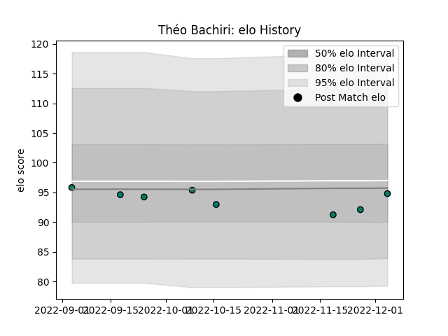

---  
layout: page  
title: Théo Bachiri  
date: 2023-02-02 19:02:01.059810  
categories: player  
---
# Théo Bachiri

## Positions: SH

## Current elo: 91.0

## Current Percentile: 45.0

# Elo History

# Match History

| Team     |   Appearances |   Win Rate |
|:---------|--------------:|-----------:|
| Suresnes |            12 |   0.333333 |

| Opponent                   |   Matches |   Win Rate |
|:---------------------------|----------:|-----------:|
| Narbonne                   |         2 |          0 |
| Nice                       |         2 |          0 |
| Blagnac                    |         1 |          0 |
| Bourgoin-Jallieu           |         1 |          1 |
| Carqueiranne-Hyères        |         1 |          0 |
| Chambery                   |         1 |          1 |
| Cognac Saint Jean d'Angély |         1 |          1 |
| Dax                        |         1 |          0 |
| Rennes                     |         1 |          1 |
| US Bressane                |         1 |          0 |