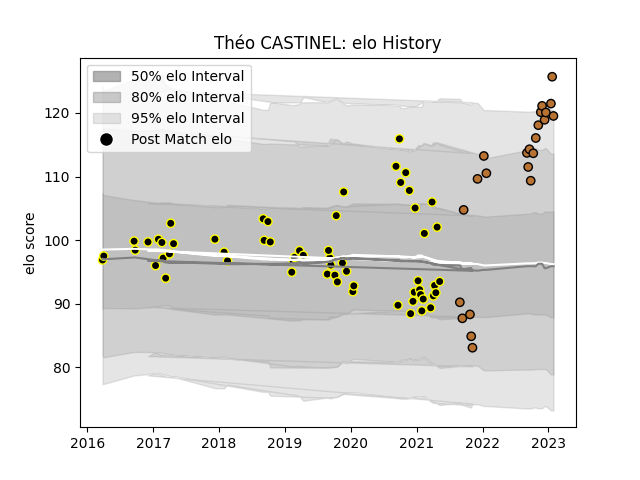

---  
layout: page  
title: Théo CASTINEL  
date: 2023-03-12 11:32:52.510063  
categories: player  
---
# Théo CASTINEL

## Positions: P

## Current elo: 114.0

## Current Percentile: 94.0

# Elo History

# Match History

| Team           |   Appearances |   Win Rate |
|:---------------|--------------:|-----------:|
| Mont-de-Marsan |            60 |    0.475   |
| Narbonne       |            27 |    0.37037 |

| Opponent                   |   Matches |   Win Rate |
|:---------------------------|----------:|-----------:|
| Montauban                  |         8 |   0.5      |
| Beziers                    |         8 |   0.75     |
| Aurillac                   |         7 |   0.571429 |
| Provence Rugby             |         6 |   0.833333 |
| Oyonnax                    |         5 |   0.1      |
| Nevers                     |         4 |   0.25     |
| Vannes                     |         4 |   0.125    |
| Bourgoin-Jallieu           |         3 |   0.666667 |
| US Bressane                |         3 |   0.333333 |
| Soyaux-Angouleme           |         3 |   0.333333 |
| Colomiers                  |         3 |   0.333333 |
| Biarritz Olympique         |         3 |   0.5      |
| Perpignan                  |         3 |   0        |
| Valence Romans Drome Rugby |         3 |   0.166667 |
| Carcassonne                |         3 |   0.333333 |
| Suresnes                   |         2 |   1        |
| Nice                       |         2 |   1        |
| Agen                       |         2 |   0        |
| Albi                       |         2 |   0        |
| Mont-de-Marsan             |         2 |   0        |
| Narbonne                   |         1 |   1        |
| Massy                      |         1 |   1        |
| Grenoble                   |         1 |   0        |
| Dax                        |         1 |   0        |
| Rennes                     |         1 |   1        |
| Rouen                      |         1 |   1        |
| Cognac Saint Jean d'Angély |         1 |   1        |
| Chambery                   |         1 |   0        |
| Tarbes                     |         1 |   0        |
| Blagnac                    |         1 |   0.5      |
| Bayonne                    |         1 |   0        |