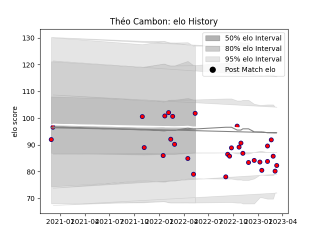

---  
layout: page  
title: Théo Cambon  
date: 2023-01-13 11:27:17.562309  
categories: player  
---
# Théo Cambon

## Positions: FL

## Current elo: 102.0

## Current Percentile: 14.0

# Elo History

# Match History

| Team     |   Appearances |   Win Rate |
|:---------|--------------:|-----------:|
| Aurillac |            24 |   0.458333 |

| Opponent           |   Matches |   Win Rate |
|:-------------------|----------:|-----------:|
| Carcassonne        |         3 |   0.333333 |
| Oyonnax            |         2 |   0.5      |
| Grenoble           |         2 |   0        |
| Rouen              |         2 |   0.5      |
| Provence Rugby     |         2 |   1        |
| Beziers            |         2 |   1        |
| Bayonne            |         1 |   0        |
| US Bressane        |         1 |   0        |
| Soyaux-Angouleme   |         1 |   1        |
| Perpignan          |         1 |   0        |
| Montauban          |         1 |   1        |
| Nevers             |         1 |   0        |
| Mont-de-Marsan     |         1 |   0        |
| Massy              |         1 |   1        |
| Colomiers          |         1 |   1        |
| Biarritz Olympique |         1 |   0        |
| Vannes             |         1 |   0        |