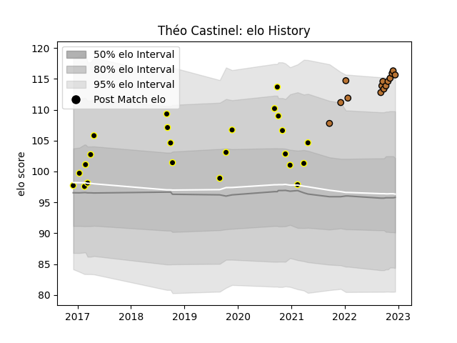

---  
layout: page  
title: Théo Castinel  
date: 2022-11-22 11:34:32.208844  
categories: player  
---
# Théo Castinel

## Positions: P

## Current elo: 116.0

## Current Percentile: 94.0

# Elo History

# Match History

| Team           |   Appearances |   Win Rate |
|:---------------|--------------:|-----------:|
| Mont-de-Marsan |            23 |   0.434783 |
| Narbonne       |            12 |   0.5      |

| Opponent                   |   Matches |   Win Rate |
|:---------------------------|----------:|-----------:|
| Aurillac                   |         4 |   0.25     |
| Beziers                    |         4 |   1        |
| Montauban                  |         3 |   0.666667 |
| Colomiers                  |         3 |   0.333333 |
| Provence Rugby             |         2 |   1        |
| Oyonnax                    |         2 |   0        |
| Nevers                     |         1 |   0        |
| Valence Romans Drome Rugby |         1 |   0        |
| US Bressane                |         1 |   1        |
| Suresnes                   |         1 |   1        |
| Soyaux-Angouleme           |         1 |   0        |
| Perpignan                  |         1 |   0        |
| Nice                       |         1 |   1        |
| Agen                       |         1 |   0        |
| Narbonne                   |         1 |   1        |
| Albi                       |         1 |   0        |
| Mont-de-Marsan             |         1 |   0        |
| Grenoble                   |         1 |   0        |
| Cognac Saint Jean d'Angély |         1 |   1        |
| Carcassonne                |         1 |   0        |
| Bourgoin-Jallieu           |         1 |   0        |
| Blagnac                    |         1 |   0.5      |
| Vannes                     |         1 |   0.5      |