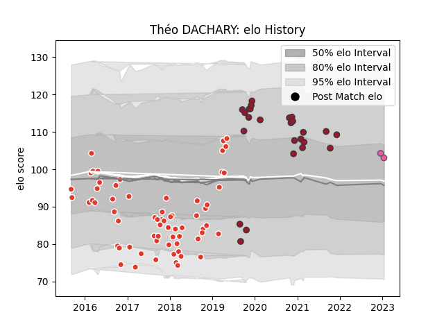

---  
layout: page  
title: Théo DACHARY  
date: 2023-02-10 10:36:51.067686  
categories: player  
---
# Théo DACHARY

## Positions: C

## Current elo: 98.0

## Current Percentile: 47.0

# Elo History

# Match History

| Team                 |   Appearances |   Win Rate |
|:---------------------|--------------:|-----------:|
| Biarritz Olympique   |            66 |   0.537879 |
| Toulon               |            25 |   0.66     |
| Stade Francais Paris |             3 |   0.666667 |

| Opponent             |   Matches |   Win Rate |
|:---------------------|----------:|-----------:|
| Carcassonne          |         7 |   0.428571 |
| Bayonne              |         6 |   0.666667 |
| Brive                |         6 |   0.583333 |
| Aurillac             |         5 |   0.8      |
| Colomiers            |         5 |   0.2      |
| Vannes               |         4 |   0.5      |
| Mont-de-Marsan       |         4 |   0.25     |
| Soyaux-Angouleme     |         4 |   0.25     |
| Provence Rugby       |         4 |   0.5      |
| Pau                  |         4 |   0.875    |
| Perpignan            |         3 |   0.666667 |
| Nevers               |         3 |   0.666667 |
| Narbonne             |         3 |   1        |
| Montauban            |         3 |   0.666667 |
| Agen                 |         3 |   1        |
| Grenoble             |         3 |   0.333333 |
| Dax                  |         3 |   0.333333 |
| Beziers              |         3 |   1        |
| Massy                |         2 |   0.5      |
| Lions                |         2 |   0.5      |
| La Rochelle          |         2 |   0.5      |
| Montpellier Herault  |         2 |   0.5      |
| Albi                 |         2 |   0        |
| Bordeaux Begles      |         2 |   0.5      |
| London Irish         |         1 |   1        |
| Scarlets             |         1 |   1        |
| Tarbes               |         1 |   1        |
| Stade Francais Paris |         1 |   0        |
| Castres Olympique    |         1 |   1        |
| Racing 92            |         1 |   1        |
| Bourgoin-Jallieu     |         1 |   1        |
| Oyonnax              |         1 |   1        |
| Lyon                 |         1 |   0        |