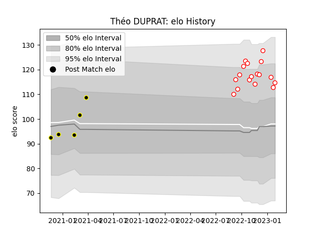

---  
layout: page  
title: Théo DUPRAT  
date: 2023-01-21 15:46:01.800423  
categories: player  
---
# Théo DUPRAT

## Positions: FB

## Current elo: 117.0

## Current Percentile: 93.0

# Elo History

# Match History

| Team           |   Appearances |   Win Rate |
|:---------------|--------------:|-----------:|
| Dax            |            15 |   0.866667 |
| Mont-de-Marsan |             5 |   0.4      |

| Opponent                   |   Matches |   Win Rate |
|:---------------------------|----------:|-----------:|
| Nice                       |         2 |          1 |
| US Bressane                |         2 |          1 |
| Provence Rugby             |         2 |          1 |
| Albi                       |         1 |          0 |
| Valence Romans Drome Rugby |         1 |          1 |
| Tarbes                     |         1 |          1 |
| Suresnes                   |         1 |          1 |
| Rennes                     |         1 |          1 |
| Narbonne                   |         1 |          1 |
| Aurillac                   |         1 |          0 |
| Montauban                  |         1 |          0 |
| Cognac Saint Jean d'Angély |         1 |          1 |
| Chambery                   |         1 |          1 |
| Carqueiranne-Hyères        |         1 |          1 |
| Bourgoin-Jallieu           |         1 |          0 |
| Blagnac                    |         1 |          1 |
| Vannes                     |         1 |          0 |