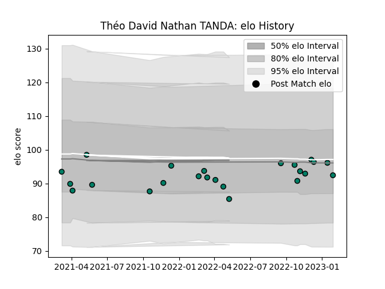

---  
layout: page  
title: Théo David Nathan TANDA  
date: 2023-02-06 11:14:30.980581  
categories: player  
---
# Théo David Nathan TANDA

## Positions: FL

## Current elo: 95.0

## Current Percentile: 61.0

# Elo History

# Match History

| Team     |   Appearances |   Win Rate |
|:---------|--------------:|-----------:|
| Suresnes |            23 |    0.26087 |

| Opponent                   |   Matches |   Win Rate |
|:---------------------------|----------:|-----------:|
| Albi                       |         3 |   0.333333 |
| Massy                      |         3 |   0        |
| Tarbes                     |         3 |   1        |
| Blagnac                    |         2 |   0        |
| Nice                       |         2 |   0        |
| US Bressane                |         2 |   0        |
| Valence Romans Drome Rugby |         2 |   0        |
| Carqueiranne-Hyères        |         1 |   0        |
| Chambery                   |         1 |   0        |
| Cognac Saint Jean d'Angély |         1 |   1        |
| Dax                        |         1 |   1        |
| Narbonne                   |         1 |   0        |
| Soyaux-Angouleme           |         1 |   0        |