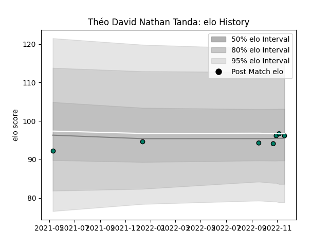

---  
layout: page  
title: Théo David Nathan Tanda  
date: 2022-12-09 13:16:09.848365  
categories: player  
---
# Théo David Nathan Tanda

## Positions: FL

## Current elo: 97.0

## Current Percentile: 53.0

# Elo History

# Match History

| Team     |   Appearances |   Win Rate |
|:---------|--------------:|-----------:|
| Suresnes |             8 |      0.375 |

| Opponent                   |   Matches |   Win Rate |
|:---------------------------|----------:|-----------:|
| US Bressane                |         2 |          0 |
| Albi                       |         1 |          1 |
| Cognac Saint Jean d'Angély |         1 |          1 |
| Massy                      |         1 |          0 |
| Narbonne                   |         1 |          0 |
| Tarbes                     |         1 |          1 |
| Valence Romans Drome Rugby |         1 |          0 |