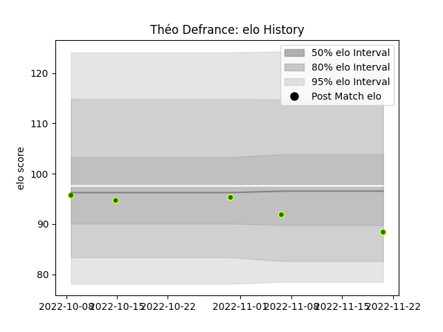

---  
layout: page  
title: Théo Defrance  
date: 2022-11-16 11:41:33.547961  
categories: player  
---
# Théo Defrance

## Positions: FH

## Current elo: 92.0

## Current Percentile: None

# Elo History

# Match History

| Team                |   Appearances |   Win Rate |
|:--------------------|--------------:|-----------:|
| Carqueiranne-Hyères |             4 |        0.5 |

| Opponent                   |   Matches |   Win Rate |
|:---------------------------|----------:|-----------:|
| Blagnac                    |         1 |          0 |
| Cognac Saint Jean d'Angély |         1 |          1 |
| Tarbes                     |         1 |          1 |
| US Bressane                |         1 |          0 |