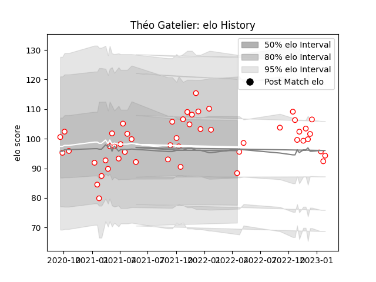

---  
layout: page  
title: Théo Gatelier  
date: 2023-01-15 12:03:35.839877  
categories: player  
---
# Théo Gatelier

## Positions: FB, W

## Current elo: 88.0

## Current Percentile: 66.0

# Elo History

# Match History

| Team   |   Appearances |   Win Rate |
|:-------|--------------:|-----------:|
| Dax    |            49 |   0.571429 |

| Opponent                   |   Matches |   Win Rate |
|:---------------------------|----------:|-----------:|
| Albi                       |         4 |   0.25     |
| Blagnac                    |         4 |   0.5      |
| Tarbes                     |         4 |   0.5      |
| Suresnes                   |         4 |   0.5      |
| Nice                       |         4 |   0.75     |
| Aubenas                    |         3 |   0.666667 |
| US Bressane                |         3 |   0.666667 |
| Narbonne                   |         3 |   0.666667 |
| Valence Romans Drome Rugby |         3 |   0.666667 |
| Dijon                      |         3 |   1        |
| Cognac Saint Jean d'Angély |         3 |   0        |
| Chambery                   |         3 |   0.666667 |
| Bourgoin-Jallieu           |         3 |   1        |
| Massy                      |         2 |   0        |
| Rennes                     |         1 |   1        |
| Soyaux-Angouleme           |         1 |   0        |
| Carqueiranne-Hyères        |         1 |   1        |