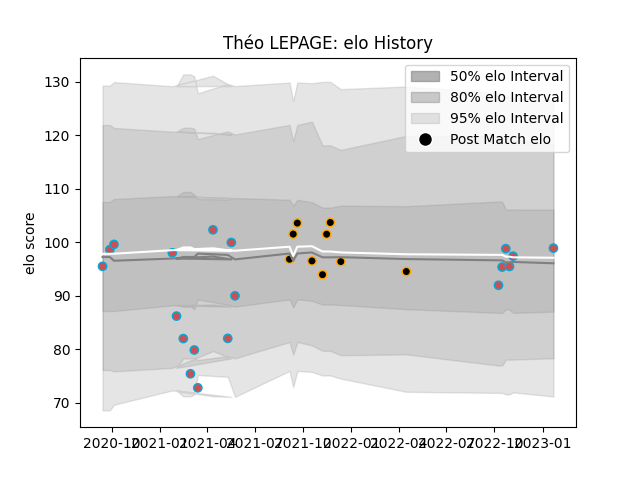

---  
layout: page  
title: Théo LEPAGE  
date: 2023-03-30 11:33:37.058711  
categories: player  
---
# Théo LEPAGE

Last updated: 2023-03-30
## Positions: N8, FL

## Current elo: 102.0

## Current Percentile: 59.0

# Elo History

# Match History

| Team             |   Appearances |   Win Rate |
|:-----------------|--------------:|-----------:|
| Bourgoin-Jallieu |            23 |   0.478261 |
| Chambery         |             9 |   0.555556 |

| Opponent                   |   Matches |   Win Rate |
|:---------------------------|----------:|-----------:|
| Albi                       |         5 |   0.4      |
| Tarbes                     |         5 |   0.6      |
| Nice                       |         4 |   0.25     |
| Suresnes                   |         3 |   0.666667 |
| Aubenas                    |         2 |   0.5      |
| Chambery                   |         2 |   0.5      |
| Dijon                      |         2 |   1        |
| Massy                      |         2 |   0.5      |
| US Bressane                |         2 |   0.25     |
| Blagnac                    |         1 |   1        |
| Bourgoin-Jallieu           |         1 |   0        |
| Dax                        |         1 |   1        |
| Narbonne                   |         1 |   0        |
| Valence Romans Drome Rugby |         1 |   0.5      |