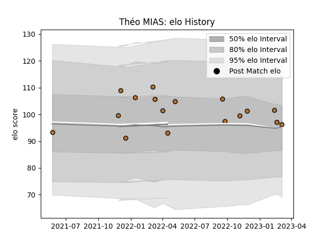

---  
layout: page  
title: Théo MIAS  
date: 2023-03-30 11:31:00.346034  
categories: player  
---
# Théo MIAS

Last updated: 2023-03-30
## Positions: W, C

## Current elo: 91.0

## Current Percentile: 54.0

# Elo History

# Match History

| Team     |   Appearances |   Win Rate |
|:---------|--------------:|-----------:|
| Narbonne |            18 |   0.333333 |

| Opponent                   |   Matches |   Win Rate |
|:---------------------------|----------:|-----------:|
| US Bressane                |         3 |   0.333333 |
| Cognac Saint Jean d'Angély |         2 |   1        |
| Grenoble                   |         2 |   0.25     |
| Agen                       |         1 |   0        |
| Albi                       |         1 |   0        |
| Beziers                    |         1 |   0        |
| Montauban                  |         1 |   0        |
| Nevers                     |         1 |   0        |
| Oyonnax                    |         1 |   0        |
| Rennes                     |         1 |   1        |
| Suresnes                   |         1 |   1        |
| Tarbes                     |         1 |   0        |
| Valence Romans Drome Rugby |         1 |   0        |
| Vannes                     |         1 |   0.5      |