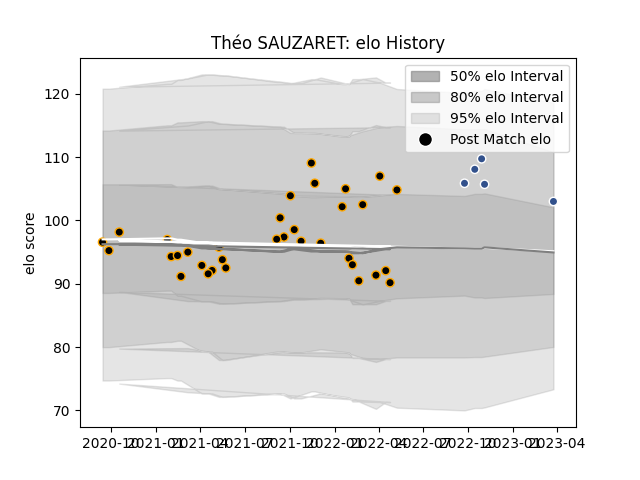

---  
layout: page  
title: Théo SAUZARET  
date: 2023-03-29 11:31:02.104600  
categories: player  
---
# Théo SAUZARET

Last updated: 2023-03-29
## Positions: P

## Current elo: 103.0

## Current Percentile: 80.0

# Elo History

# Match History

| Team     |   Appearances |   Win Rate |
|:---------|--------------:|-----------:|
| Chambery |            34 |   0.397059 |
| Agen     |             5 |   0.6      |

| Opponent                   |   Matches |   Win Rate |
|:---------------------------|----------:|-----------:|
| Aubenas                    |         4 |   0.5      |
| Blagnac                    |         3 |   0.333333 |
| Tarbes                     |         3 |   0.666667 |
| Dax                        |         3 |   0.333333 |
| Dijon                      |         3 |   0.666667 |
| Massy                      |         3 |   0.166667 |
| Nice                       |         3 |   0.333333 |
| Albi                       |         2 |   0        |
| Soyaux-Angouleme           |         2 |   0.5      |
| Valence Romans Drome Rugby |         2 |   0        |
| US Bressane                |         2 |   0        |
| Suresnes                   |         2 |   1        |
| Montauban                  |         1 |   0        |
| Rouen                      |         1 |   1        |
| Narbonne                   |         1 |   1        |
| Cognac Saint Jean d'Angély |         1 |   0        |
| Bourgoin-Jallieu           |         1 |   0        |
| Biarritz Olympique         |         1 |   1        |
| Vannes                     |         1 |   1        |