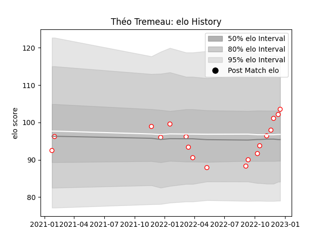

---  
layout: page  
title: Théo Tremeau  
date: 2022-11-22 11:27:17.111686  
categories: player  
---
# Théo Tremeau

## Positions: FL

## Current elo: 98.0

## Current Percentile: 53.0

# Elo History

# Match History

| Team   |   Appearances |   Win Rate |
|:-------|--------------:|-----------:|
| Dax    |            15 |   0.666667 |

| Opponent                   |   Matches |   Win Rate |
|:---------------------------|----------:|-----------:|
| Aubenas                    |         2 |        0.5 |
| Dijon                      |         2 |        0.5 |
| Suresnes                   |         2 |        1   |
| Blagnac                    |         1 |        0   |
| Bourgoin-Jallieu           |         1 |        0   |
| Cognac Saint Jean d'Angély |         1 |        1   |
| Massy                      |         1 |        0   |
| Nice                       |         1 |        1   |
| Rennes                     |         1 |        1   |
| Tarbes                     |         1 |        1   |
| US Bressane                |         1 |        1   |
| Valence Romans Drome Rugby |         1 |        1   |