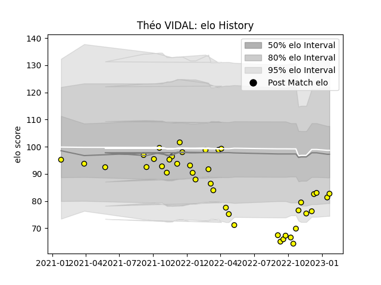

---  
layout: page  
title: Théo VIDAL  
date: 2023-01-27 19:01:42.933826  
categories: player  
---
# Théo VIDAL

## Positions: FH, SH

## Current elo: 83.0

## Current Percentile: 13.0

# Elo History

# Match History

| Team   |   Appearances |   Win Rate |
|:-------|--------------:|-----------:|
| Albi   |            41 |   0.670732 |

| Opponent                   |   Matches |   Win Rate |
|:---------------------------|----------:|-----------:|
| Blagnac                    |         5 |   0.6      |
| Bourgoin-Jallieu           |         4 |   0.75     |
| Chambery                   |         3 |   1        |
| Massy                      |         3 |   0.333333 |
| Suresnes                   |         3 |   0.666667 |
| Tarbes                     |         3 |   0.333333 |
| Valence Romans Drome Rugby |         3 |   0.666667 |
| Aubenas                    |         2 |   1        |
| Carqueiranne-Hyères        |         2 |   0.5      |
| Cognac Saint Jean d'Angély |         2 |   1        |
| Dax                        |         2 |   1        |
| Dijon                      |         2 |   1        |
| Nice                       |         2 |   0.25     |
| Rennes                     |         2 |   1        |
| Soyaux-Angouleme           |         2 |   0        |
| Narbonne                   |         1 |   1        |