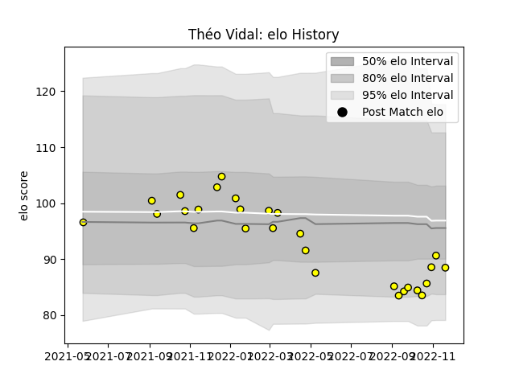

---  
layout: page  
title: Théo Vidal  
date: 2022-11-22 11:38:14.672426  
categories: player  
---
# Théo Vidal

## Positions: FH, SH

## Current elo: 88.0

## Current Percentile: 26.0

# Elo History

# Match History

| Team   |   Appearances |   Win Rate |
|:-------|--------------:|-----------:|
| Albi   |            28 |      0.625 |

| Opponent                   |   Matches |   Win Rate |
|:---------------------------|----------:|-----------:|
| Bourgoin-Jallieu           |         3 |   1        |
| Massy                      |         3 |   0.333333 |
| Suresnes                   |         3 |   0.666667 |
| Tarbes                     |         3 |   0.333333 |
| Valence Romans Drome Rugby |         3 |   0.666667 |
| Blagnac                    |         2 |   0.5      |
| Chambery                   |         2 |   1        |
| Dijon                      |         2 |   1        |
| Nice                       |         2 |   0.25     |
| Carqueiranne-Hyères        |         1 |   0        |
| Dax                        |         1 |   1        |
| Narbonne                   |         1 |   1        |
| Rennes                     |         1 |   1        |
| Soyaux-Angouleme           |         1 |   0        |