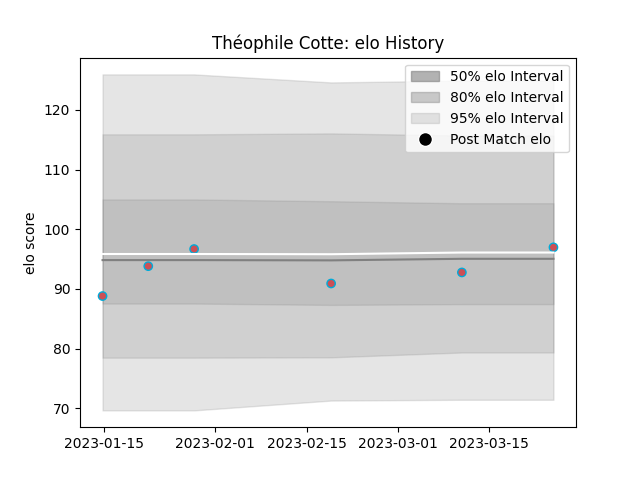

---  
layout: page  
title: Théophile COTTE  
date: 2023-02-05 15:13:35.991074  
categories: player  
---
# Théophile COTTE

## Positions: FL

## Current elo: 90.0

## Current Percentile: 22.0

# Elo History

# Match History

| Team             |   Appearances |   Win Rate |
|:-----------------|--------------:|-----------:|
| Bourgoin-Jallieu |           105 |   0.404762 |
| Nevers           |            67 |   0.537313 |
| Lyon             |             9 |   0.444444 |

| Opponent                   |   Matches |   Win Rate |
|:---------------------------|----------:|-----------:|
| Colomiers                  |        12 |   0.333333 |
| Mont-de-Marsan             |        11 |   0.727273 |
| Beziers                    |        10 |   0.6      |
| Carcassonne                |        10 |   0.4      |
| Provence Rugby             |         9 |   0.555556 |
| Aurillac                   |         9 |   0.777778 |
| Narbonne                   |         9 |   0.611111 |
| Albi                       |         9 |   0.222222 |
| Perpignan                  |         8 |   0.25     |
| Oyonnax                    |         8 |   0.125    |
| Montauban                  |         8 |   0.5      |
| Agen                       |         8 |   0.625    |
| Biarritz Olympique         |         8 |   0.375    |
| Vannes                     |         6 |   0.166667 |
| Dax                        |         6 |   0.416667 |
| Lyon                       |         4 |   0.25     |
| Tarbes                     |         4 |   0.5      |
| Pau                        |         4 |   0.5      |
| Grenoble                   |         4 |   0.125    |
| Valence Romans Drome Rugby |         3 |   0.5      |
| La Rochelle                |         3 |   0.166667 |
| Bayonne                    |         3 |   0        |
| Rouen                      |         3 |   0.666667 |
| Soyaux-Angouleme           |         3 |   0.666667 |
| Massy                      |         2 |   1        |
| Cardiff Blues              |         2 |   0        |
| US Bressane                |         2 |   0.5      |
| Carqueiranne-Hyères        |         2 |   1        |
| Sale Sharks                |         1 |   0        |
| Suresnes                   |         1 |   0        |
| Stade Toulousain           |         1 |   1        |
| Rennes                     |         1 |   1        |
| Roval Drome XV             |         1 |   1        |
| Auch                       |         1 |   0        |
| Chambery                   |         1 |   1        |
| Nice                       |         1 |   1        |
| Blagnac                    |         1 |   0        |
| Montpellier Herault        |         1 |   0        |
| Clermont Auvergne          |         1 |   1        |