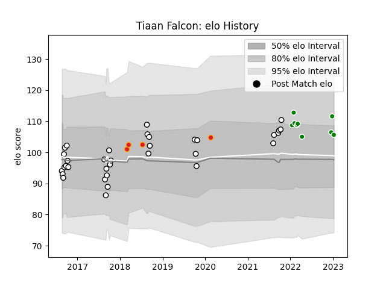

---  
layout: page  
title: Tiaan Falcon  
date: 2023-01-13 11:36:44.664585  
categories: player  
---
# Tiaan Falcon

## Positions: FH, FB

## Current elo: 106.0

## Current Percentile: 77.0

# Elo History

# Match History

| Team            |   Appearances |   Win Rate |
|:----------------|--------------:|-----------:|
| Hawke's Bay     |            34 |   0.411765 |
| Toyota Verblitz |             9 |   0.444444 |
| Chiefs          |             4 |   1        |

| Opponent                          |   Matches |   Win Rate |
|:----------------------------------|----------:|-----------:|
| Bay of Plenty                     |         5 |   0.4      |
| Counties Manukau                  |         4 |   0.25     |
| Otago                             |         4 |   0.75     |
| Wellington                        |         3 |   0.333333 |
| Southland                         |         3 |   1        |
| Canterbury                        |         3 |   0.333333 |
| Tasman                            |         3 |   0.333333 |
| Black Rams Tokyo                  |         2 |   0.5      |
| Waikato                           |         2 |   0        |
| Toshiba Brave Lupus Tokyo         |         2 |   0.5      |
| Manawatu                          |         2 |   1        |
| Taranaki                          |         2 |   0        |
| Urayasu D-Rocks                   |         1 |   1        |
| Tokyo Sungoliath                  |         1 |   0        |
| Sunwolves                         |         1 |   1        |
| Auckland                          |         1 |   0        |
| Shizuoka Blue Revs                |         1 |   1        |
| North Harbour                     |         1 |   0        |
| Mitsubishi Dynaboars              |         1 |   0        |
| Kubota Spears Funabashi Tokyo-Bay |         1 |   0        |
| Hurricanes                        |         1 |   1        |
| Bulls                             |         1 |   1        |
| Blues                             |         1 |   1        |
| Northland                         |         1 |   0        |