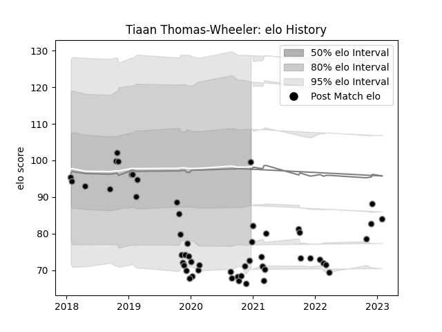

---  
layout: page  
title: Tiaan Thomas-Wheeler  
date: 2023-02-02 19:07:12.858881  
categories: player  
---
# Tiaan Thomas-Wheeler

## Positions: C

## Current elo: 99.0

## Current Percentile: 6.0

# Elo History

# Match History

| Team    |   Appearances |   Win Rate |
|:--------|--------------:|-----------:|
| Ospreys |            54 |   0.324074 |

| Opponent           |   Matches |   Win Rate |
|:-------------------|----------:|-----------:|
| Ulster             |         5 |   0.4      |
| Munster            |         5 |   0        |
| Zebre              |         4 |   0.75     |
| Dragons            |         4 |   0.375    |
| Cardiff Blues      |         4 |   0.5      |
| Glasgow Warriors   |         4 |   0.25     |
| Leinster           |         3 |   0.333333 |
| Connacht           |         3 |   0.333333 |
| Edinburgh          |         2 |   1        |
| Benetton Treviso   |         2 |   1        |
| Racing 92          |         2 |   0        |
| Saracens           |         2 |   0        |
| Scarlets           |         2 |   0        |
| Sharks             |         2 |   0        |
| Worcester Warriors |         2 |   0.5      |
| Cheetahs           |         1 |   0        |
| Gloucester Rugby   |         1 |   0        |
| Lions              |         1 |   0        |
| Castres Olympique  |         1 |   1        |
| Pau                |         1 |   0        |
| Southern Kings     |         1 |   0        |
| Bulls              |         1 |   0        |
| Bath Rugby         |         1 |   0        |