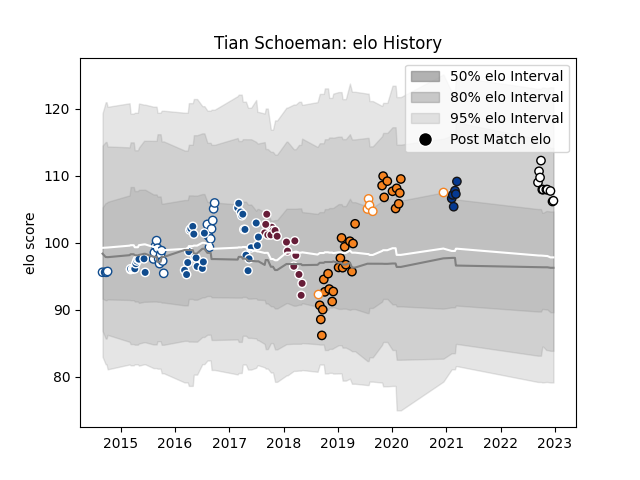

---  
layout: page  
title: Tian Schoeman  
date: 2022-12-18 16:34:10.887276  
categories: player  
---
# Tian Schoeman

## Positions: FH

## Current elo: 100.0

## Current Percentile: 71.0

# Elo History

# Match History

| Team                |   Appearances |   Win Rate |
|:--------------------|--------------:|-----------:|
| Bulls               |            38 |   0.513158 |
| Cheetahs            |            30 |   0.383333 |
| Blue Bulls          |            22 |   0.681818 |
| Bordeaux Begles     |            17 |   0.352941 |
| Newcastle Falcons   |            10 |   0.2      |
| Bath Rugby          |             6 |   0.666667 |
| Free State Cheetahs |             6 |   0.5      |

| Opponent                 |   Matches |   Win Rate |
|:-------------------------|----------:|-----------:|
| Southern Kings           |         7 |   0.857143 |
| Western Province         |         6 |   0.5      |
| Cheetahs                 |         6 |   0.666667 |
| Connacht                 |         4 |   0        |
| Griquas                  |         4 |   1        |
| Golden Lions             |         4 |   0.25     |
| Sunwolves                |         4 |   0.75     |
| Stormers                 |         4 |   0.25     |
| Free State Cheetahs      |         4 |   0.75     |
| Zebre                    |         3 |   0.666667 |
| Natal Sharks             |         3 |   0.333333 |
| Ospreys                  |         3 |   0.333333 |
| Dragons                  |         3 |   0.333333 |
| Lions                    |         3 |   0.333333 |
| Sharks                   |         3 |   0.833333 |
| Cardiff Blues            |         3 |   0.333333 |
| Jaguares                 |         2 |   0.5      |
| Pumas                    |         2 |   1        |
| Scarlets                 |         2 |   0        |
| Northampton Saints       |         2 |   0.5      |
| Newcastle Falcons        |         2 |   0.5      |
| Toulon                   |         2 |   0.5      |
| Munster                  |         2 |   0        |
| Ulster                   |         2 |   0.25     |
| Western Force            |         2 |   1        |
| Melbourne Rebels         |         2 |   0.5      |
| Queensland Reds          |         2 |   1        |
| Agen                     |         2 |   1        |
| Blue Bulls               |         2 |   0.5      |
| Clermont Auvergne        |         2 |   0.5      |
| Crusaders                |         2 |   0.5      |
| Harlequins               |         2 |   0        |
| Gloucester Rugby         |         2 |   1        |
| Glasgow Warriors         |         2 |   0        |
| Eastern Province Kings   |         2 |   1        |
| Hurricanes               |         1 |   0        |
| Stade Toulousain         |         1 |   0        |
| Castres Olympique        |         1 |   0        |
| Brumbies                 |         1 |   0        |
| Stade Francais Paris     |         1 |   1        |
| Bristol Rugby            |         1 |   1        |
| Brive                    |         1 |   0        |
| Saracens                 |         1 |   0        |
| Boland Cavaliers         |         1 |   1        |
| Blues                    |         1 |   0        |
| Benetton Treviso         |         1 |   1        |
| Worcester Warriors       |         1 |   0        |
| Chiefs                   |         1 |   0        |
| RC Enisei                |         1 |   1        |
| Sale Sharks              |         1 |   1        |
| Racing 92                |         1 |   0        |
| La Rochelle              |         1 |   0        |
| Oyonnax                  |         1 |   0        |
| Edinburgh                |         1 |   0        |
| Exeter Chiefs            |         1 |   0        |
| New South Wales Waratahs |         1 |   0        |
| Lyon                     |         1 |   0        |
| London Irish             |         1 |   0        |
| Highlanders              |         1 |   0        |
| Bath Rugby               |         1 |   0        |
| Leicester Tigers         |         1 |   0        |
| Leinster                 |         1 |   0        |