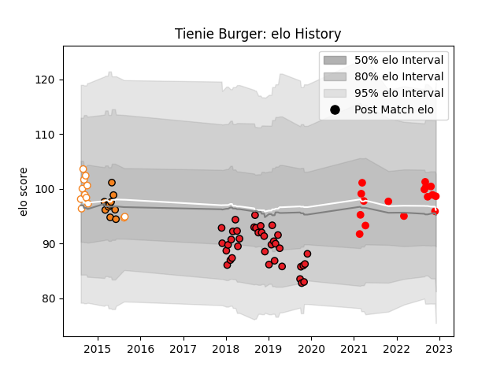

---  
layout: page  
title: Tienie Burger  
date: 2023-02-03 10:22:32.919707  
categories: player  
---
# Tienie Burger

## Positions: FL

## Current elo: 102.0

## Current Percentile: 53.0

# Elo History

# Match History

| Team                |   Appearances |   Win Rate |
|:--------------------|--------------:|-----------:|
| Southern Kings      |            37 |  0.0945946 |
| Rouen               |            23 |  0.478261  |
| Free State Cheetahs |            16 |  0.46875   |
| Cheetahs            |            11 |  0.272727  |

| Opponent                 |   Matches |   Win Rate |
|:-------------------------|----------:|-----------:|
| Oyonnax                  |         5 |   0.6      |
| Cheetahs                 |         5 |   0        |
| Benetton Treviso         |         4 |   0        |
| Griquas                  |         4 |   1        |
| Edinburgh                |         4 |   0.25     |
| Ulster                   |         4 |   0        |
| Dragons                  |         3 |   0.5      |
| Cardiff Blues            |         3 |   0        |
| Pumas                    |         3 |   0.333333 |
| Leinster                 |         3 |   0        |
| Munster                  |         3 |   0        |
| Stormers                 |         2 |   0.5      |
| Montauban                |         2 |   0.5      |
| Scarlets                 |         2 |   0        |
| Connacht                 |         2 |   0        |
| Natal Sharks             |         2 |   0.25     |
| Blue Bulls               |         2 |   0        |
| Golden Lions             |         2 |   0.5      |
| Provence Rugby           |         2 |   0        |
| Western Province         |         2 |   0        |
| Ospreys                  |         2 |   0.5      |
| Soyaux-Angouleme         |         2 |   1        |
| New South Wales Waratahs |         1 |   0        |
| Agen                     |         1 |   0        |
| Perpignan                |         1 |   1        |
| Queensland Reds          |         1 |   0        |
| Vannes                   |         1 |   1        |
| Western Force            |         1 |   1        |
| Nevers                   |         1 |   1        |
| Lions                    |         1 |   0        |
| Narbonne                 |         1 |   0        |
| Mont-de-Marsan           |         1 |   0        |
| Massy                    |         1 |   1        |
| Aurillac                 |         1 |   0        |
| Highlanders              |         1 |   0        |
| Grenoble                 |         1 |   0        |
| Glasgow Warriors         |         1 |   0        |
| Eastern Province Kings   |         1 |   1        |
| Colomiers                |         1 |   1        |
| Chiefs                   |         1 |   0        |
| Bulls                    |         1 |   0        |
| Brumbies                 |         1 |   0        |
| Blues                    |         1 |   1        |
| Biarritz Olympique       |         1 |   0        |
| Beziers                  |         1 |   0        |
| Zebre                    |         1 |   0        |