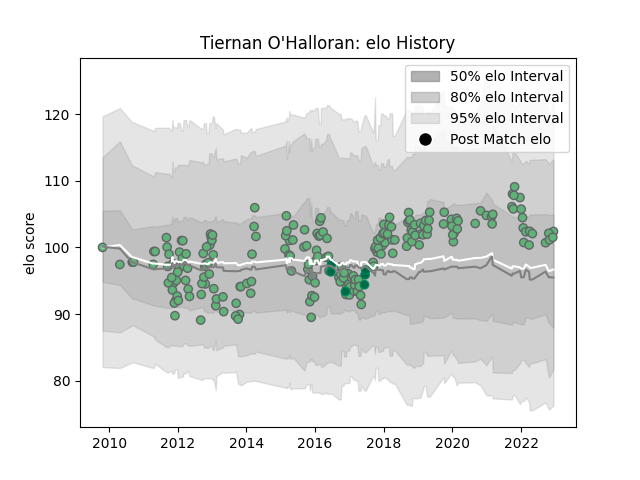

---  
layout: page  
title: Tiernan O'Halloran  
date: 2022-12-14 11:31:04.605567  
categories: player  
---
# Tiernan O'Halloran

## Positions: FB, W

## Country: Ireland

## Current elo: 102.0

## Current Percentile: 68.0

# Elo History

# Match History

| Team     |   Appearances |   Win Rate |
|:---------|--------------:|-----------:|
| Connacht |           209 |   0.456938 |
| Ireland  |             6 |   0.666667 |

| Opponent                 |   Matches |   Win Rate |
|:-------------------------|----------:|-----------:|
| Ulster                   |        17 |   0.294118 |
| Scarlets                 |        17 |   0.294118 |
| Benetton Treviso         |        17 |   0.794118 |
| Munster                  |        16 |   0.1875   |
| Cardiff Blues            |        16 |   0.375    |
| Leinster                 |        15 |   0.266667 |
| Dragons                  |        14 |   0.714286 |
| Ospreys                  |        14 |   0.428571 |
| Glasgow Warriors         |        14 |   0.25     |
| Zebre                    |        13 |   0.923077 |
| Edinburgh                |        12 |   0.583333 |
| Stade Toulousain         |         5 |   0.2      |
| Gloucester Rugby         |         4 |   0        |
| Harlequins               |         4 |   0.25     |
| Brive                    |         4 |   0.75     |
| Cheetahs                 |         3 |   0.666667 |
| Southern Kings           |         3 |   1        |
| Worcester Warriors       |         2 |   0.75     |
| Wasps                    |         2 |   0.5      |
| Biarritz Olympique       |         2 |   0.5      |
| South Africa             |         2 |   0        |
| Sale Sharks              |         2 |   0.5      |
| Leicester Tigers         |         2 |   0        |
| Japan                    |         2 |   1        |
| Aironi                   |         2 |   0.5      |
| RC Enisei                |         1 |   1        |
| Oyonnax                  |         1 |   1        |
| Saracens                 |         1 |   0        |
| Bordeaux Begles          |         1 |   1        |
| Sharks                   |         1 |   0        |
| Newcastle Falcons        |         1 |   1        |
| Bulls                    |         1 |   1        |
| Stade Francais Paris     |         1 |   0        |
| Montpellier Herault      |         1 |   0        |
| Canada                   |         1 |   1        |
| United States of America |         1 |   1        |