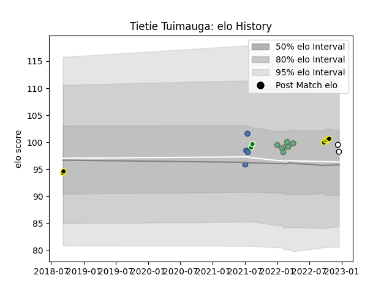

---  
layout: page  
title: Tietie Tuimauga  
date: 2022-12-14 11:32:01.825166  
categories: player  
---
# Tietie Tuimauga

## Positions: P

## Country: Samoa

## Current elo: 100.0

## Current Percentile: 68.0

# Elo History

# Match History

| Team       |   Appearances |   Win Rate |
|:-----------|--------------:|-----------:|
| Connacht   |             7 |   0.571429 |
| Wellington |             7 |   0.857143 |
| Samoa      |             4 |   0.75     |
| Manawatu   |             2 |   0.5      |
| Brive      |             1 |   0        |

| Opponent          |   Matches |   Win Rate |
|:------------------|----------:|-----------:|
| Tonga             |         3 |        1   |
| Canterbury        |         2 |        0.5 |
| Counties Manukau  |         2 |        1   |
| Waikato           |         2 |        0.5 |
| Auckland          |         1 |        1   |
| Benetton Treviso  |         1 |        1   |
| Cardiff Blues     |         1 |        0   |
| Edinburgh         |         1 |        0   |
| Glasgow Warriors  |         1 |        0   |
| Hawke's Bay       |         1 |        1   |
| Munster           |         1 |        1   |
| New Zealand Maori |         1 |        0   |
| North Harbour     |         1 |        1   |
| Scarlets          |         1 |        1   |
| Stormers          |         1 |        1   |
| Ulster            |         1 |        0   |