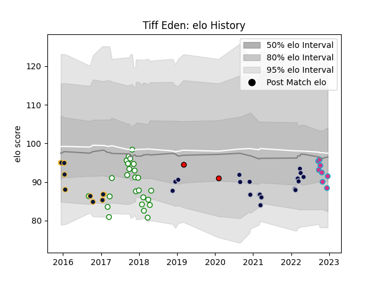

---  
layout: page  
title: Tiff Eden  
date: 2022-12-18 16:20:25.174643  
categories: player  
---
# Tiff Eden

## Positions: FH

## Current elo: 92.0

## Current Percentile: 21.0

# Elo History

# Match History

| Team               |   Appearances |   Win Rate |
|:-------------------|--------------:|-----------:|
| Nottingham         |            25 |   0.5      |
| Bristol Rugby      |            19 |   0.578947 |
| Worcester Warriors |            10 |   0.1      |
| Zebre              |             8 |   0        |
| Hartpury College   |             2 |   0        |

| Opponent            |   Matches |   Win Rate |
|:--------------------|----------:|-----------:|
| Ealing Trailfinders |         5 |   0.2      |
| London Scottish     |         4 |   0.75     |
| Rotherham Titans    |         3 |   1        |
| RC Enisei           |         3 |   0.666667 |
| Northampton Saints  |         3 |   0.666667 |
| Wasps               |         3 |   0.666667 |
| Gloucester Rugby    |         3 |   0.333333 |
| Jersey              |         2 |   0.25     |
| Richmond            |         2 |   1        |
| Bedford             |         2 |   0        |
| Leicester Tigers    |         2 |   0.5      |
| La Rochelle         |         2 |   0.5      |
| Bath Rugby          |         2 |   0        |
| Harlequins          |         2 |   0        |
| Worcester Warriors  |         2 |   1        |
| Doncaster           |         2 |   0        |
| Cornish Pirates     |         2 |   1        |
| Yorkshire Carnegie  |         2 |   0        |
| Bristol Rugby       |         2 |   0        |
| Hartpury College    |         2 |   0.5      |
| Sale Sharks         |         1 |   0        |
| Toulon              |         1 |   0        |
| Stormers            |         1 |   0        |
| Sharks              |         1 |   0        |
| Saracens            |         1 |   0        |
| London Irish        |         1 |   0        |
| Newcastle Falcons   |         1 |   1        |
| Munster             |         1 |   0        |
| Leinster            |         1 |   0        |
| Exeter Chiefs       |         1 |   0        |
| Edinburgh           |         1 |   0        |
| Dragons             |         1 |   0        |
| Brive               |         1 |   0        |
| Zebre               |         1 |   0        |