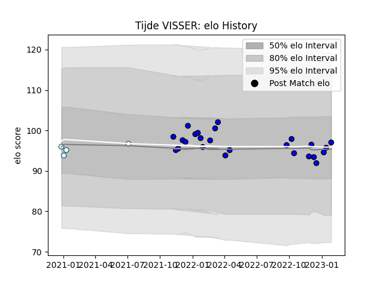

---  
layout: page  
title: Tijde VISSER  
date: 2023-03-12 11:34:19.897552  
categories: player  
---
# Tijde VISSER

## Positions: P

## Current elo: 89.0

## Current Percentile: 33.0

# Elo History

# Match History

| Team    |   Appearances |   Win Rate |
|:--------|--------------:|-----------:|
| Massy   |            31 |   0.645161 |
| Griquas |             4 |   0        |

| Opponent                   |   Matches |   Win Rate |
|:---------------------------|----------:|-----------:|
| Soyaux-Angouleme           |         3 |        0   |
| Carcassonne                |         3 |        1   |
| Chambery                   |         2 |        1   |
| Dax                        |         2 |        1   |
| Albi                       |         2 |        1   |
| Nice                       |         2 |        0.5 |
| Agen                       |         1 |        0   |
| Natal Sharks               |         1 |        0   |
| Vannes                     |         1 |        1   |
| Valence Romans Drome Rugby |         1 |        1   |
| Tarbes                     |         1 |        1   |
| Suresnes                   |         1 |        1   |
| Rouen                      |         1 |        0   |
| Pumas                      |         1 |        0   |
| Provence Rugby             |         1 |        1   |
| Grenoble                   |         1 |        0   |
| Montauban                  |         1 |        1   |
| Mont-de-Marsan             |         1 |        0   |
| Free State Cheetahs        |         1 |        0   |
| Colomiers                  |         1 |        0   |
| Cognac Saint Jean d'Angély |         1 |        1   |
| Bourgoin-Jallieu           |         1 |        1   |
| Blagnac                    |         1 |        1   |
| Biarritz Olympique         |         1 |        0   |
| Beziers                    |         1 |        0   |
| Aubenas                    |         1 |        1   |
| Western Province           |         1 |        0   |