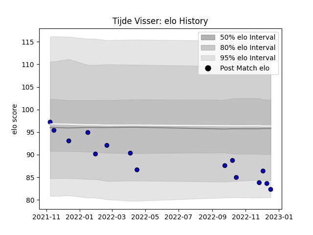

---  
layout: page  
title: Tijde Visser  
date: 2022-12-09 13:21:54.460375  
categories: player  
---
# Tijde Visser

## Positions: P

## Current elo: 86.0

## Current Percentile: 11.0

# Elo History

# Match History

| Team   |   Appearances |   Win Rate |
|:-------|--------------:|-----------:|
| Massy  |            13 |   0.769231 |

| Opponent                   |   Matches |   Win Rate |
|:---------------------------|----------:|-----------:|
| Agen                       |         1 |          0 |
| Albi                       |         1 |          1 |
| Beziers                    |         1 |          0 |
| Bourgoin-Jallieu           |         1 |          1 |
| Carcassonne                |         1 |          1 |
| Chambery                   |         1 |          1 |
| Cognac Saint Jean d'Angély |         1 |          1 |
| Dax                        |         1 |          1 |
| Nice                       |         1 |          1 |
| Provence Rugby             |         1 |          1 |
| Soyaux-Angouleme           |         1 |          0 |
| Suresnes                   |         1 |          1 |
| Tarbes                     |         1 |          1 |