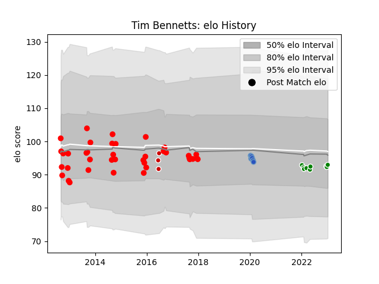

---  
layout: page  
title: Tim Bennetts  
date: 2023-02-02 19:11:05.638246  
categories: player  
---
# Tim Bennetts

## Positions: C

## Country: Japan

## Current elo: 91.0

## Current Percentile: 38.0

# Elo History

# Match History

| Team                  |   Appearances |   Win Rate |
|:----------------------|--------------:|-----------:|
| Yokohama Canon Eagles |            39 |  0.435897  |
| Green Rockets Tokatsu |            12 |  0.0833333 |
| Munakata Sanix Blues  |             6 |  0.333333  |
| Japan                 |             3 |  0.333333  |

| Opponent                          |   Matches |   Win Rate |
|:----------------------------------|----------:|-----------:|
| Black Rams Tokyo                  |         5 |   0.2      |
| Tokyo Sungoliath                  |         5 |   0        |
| Kobelco Kobe Steelers             |         5 |   0        |
| Saitama Wild Knights              |         4 |   0.25     |
| Toyota Verblitz                   |         4 |   0.25     |
| Toshiba Brave Lupus Tokyo         |         4 |   0        |
| NTT Docomo Red Hurricanes Osaka   |         4 |   1        |
| Hanazono Kintetsu Liners          |         4 |   0.75     |
| Coca-Cola Red Sparks              |         4 |   1        |
| Yokohama Canon Eagles             |         4 |   0        |
| Kubota Spears Funabashi Tokyo-Bay |         3 |   0        |
| Shizuoka Blue Revs                |         3 |   0.333333 |
| Green Rockets Tokatsu             |         3 |   0.333333 |
| Scotland                          |         2 |   0        |
| Toyota Industries Shuttles Aichi  |         2 |   1        |
| Kyuden Voltex                     |         1 |   1        |
| Munakata Sanix Blues              |         1 |   1        |
| Canada                            |         1 |   1        |
| Urayasu D-Rocks                   |         1 |   0        |