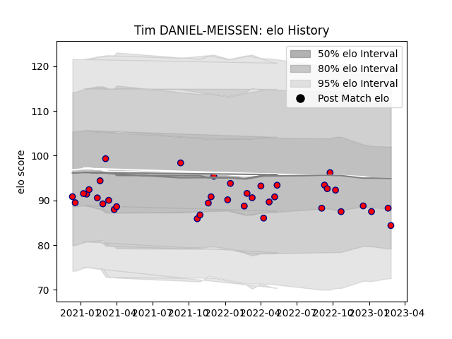

---  
layout: page  
title: Tim DANIEL-MEISSEN  
date: 2023-03-12 11:34:13.550480  
categories: player  
---
# Tim DANIEL-MEISSEN

## Positions: P

## Current elo: 85.0

## Current Percentile: 18.0

# Elo History

# Match History

| Team     |   Appearances |   Win Rate |
|:---------|--------------:|-----------:|
| Aurillac |            39 |   0.371795 |

| Opponent                   |   Matches |   Win Rate |
|:---------------------------|----------:|-----------:|
| Rouen                      |         5 |   0.6      |
| Grenoble                   |         4 |   0        |
| Mont-de-Marsan             |         4 |   0        |
| Vannes                     |         3 |   0        |
| Provence Rugby             |         3 |   0.666667 |
| Oyonnax                    |         2 |   0.5      |
| Valence Romans Drome Rugby |         2 |   0.5      |
| Soyaux-Angouleme           |         2 |   0.5      |
| Agen                       |         2 |   0        |
| Montauban                  |         2 |   0.5      |
| Massy                      |         2 |   1        |
| Carcassonne                |         2 |   0        |
| Bayonne                    |         1 |   0        |
| Nevers                     |         1 |   1        |
| Perpignan                  |         1 |   0.5      |
| Colomiers                  |         1 |   0        |
| Beziers                    |         1 |   1        |
| Narbonne                   |         1 |   1        |