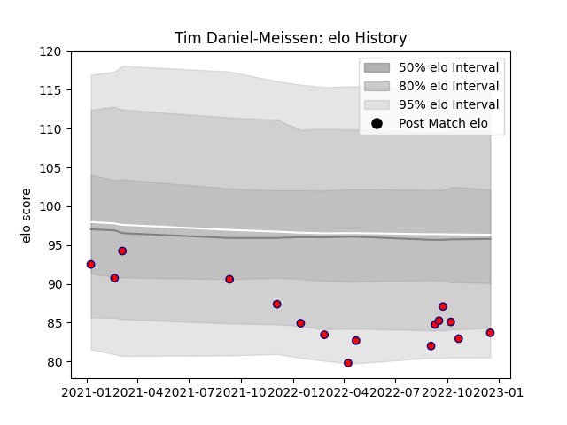

---  
layout: page  
title: Tim Daniel-Meissen  
date: 2022-12-18 16:16:20.085861  
categories: player  
---
# Tim Daniel-Meissen

## Positions: P

## Current elo: 84.0

## Current Percentile: 7.0

# Elo History

# Match History

| Team     |   Appearances |   Win Rate |
|:---------|--------------:|-----------:|
| Aurillac |            16 |     0.3125 |

| Opponent         |   Matches |   Win Rate |
|:-----------------|----------:|-----------:|
| Rouen            |         3 |   0.333333 |
| Carcassonne      |         2 |   0        |
| Grenoble         |         2 |   0        |
| Agen             |         1 |   0        |
| Bayonne          |         1 |   0        |
| Colomiers        |         1 |   0        |
| Massy            |         1 |   1        |
| Mont-de-Marsan   |         1 |   0        |
| Montauban        |         1 |   1        |
| Oyonnax          |         1 |   0        |
| Provence Rugby   |         1 |   1        |
| Soyaux-Angouleme |         1 |   1        |