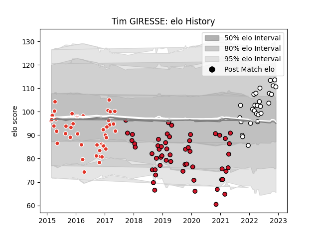

---  
layout: page  
title: Tim GIRESSE  
date: 2023-03-21 18:12:05.698001  
categories: player  
---
# Tim GIRESSE

Last updated: 2023-03-21
## Positions: W

## Current elo: 111.0

## Current Percentile: 84.0

# Elo History

# Match History

| Team                       |   Appearances |   Win Rate |
|:---------------------------|--------------:|-----------:|
| Oyonnax                    |            55 |   0.509091 |
| Biarritz Olympique         |            43 |   0.55814  |
| Valence Romans Drome Rugby |            27 |   0.62963  |

| Opponent                   |   Matches |   Win Rate |
|:---------------------------|----------:|-----------:|
| Montauban                  |         8 |   0.5625   |
| Carcassonne                |         8 |   0.625    |
| Beziers                    |         7 |   0.857143 |
| Mont-de-Marsan             |         7 |   0.714286 |
| Colomiers                  |         6 |   0.416667 |
| Aurillac                   |         6 |   0.166667 |
| Dax                        |         6 |   0.333333 |
| Soyaux-Angouleme           |         6 |   0.666667 |
| Narbonne                   |         5 |   0.8      |
| Vannes                     |         5 |   0.6      |
| Biarritz Olympique         |         5 |   0.2      |
| Bourgoin-Jallieu           |         5 |   1        |
| Massy                      |         4 |   0.5      |
| Agen                       |         4 |   0.25     |
| Cognac Saint Jean d'Angély |         3 |   1        |
| Rouen                      |         3 |   0.333333 |
| Nice                       |         3 |   1        |
| Provence Rugby             |         3 |   0.666667 |
| Perpignan                  |         3 |   0.333333 |
| Brive                      |         3 |   0        |
| US Bressane                |         3 |   0.333333 |
| Tarbes                     |         2 |   0.5      |
| Suresnes                   |         2 |   1        |
| Worcester Warriors         |         2 |   0.5      |
| Nevers                     |         2 |   1        |
| Albi                       |         2 |   0        |
| Connacht                   |         2 |   0        |
| Blagnac                    |         2 |   0.5      |
| Oyonnax                    |         1 |   0        |
| Dijon                      |         1 |   1        |
| Racing 92                  |         1 |   0        |
| Chambery                   |         1 |   1        |
| Carqueiranne-Hyères        |         1 |   1        |
| Bayonne                    |         1 |   1        |
| Aubenas                    |         1 |   1        |
| Grenoble                   |         1 |   0        |