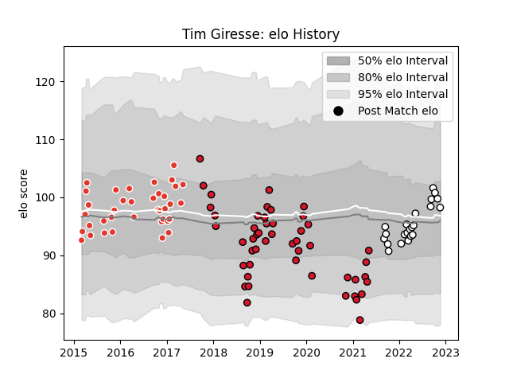

---  
layout: page  
title: Tim Giresse  
date: 2022-11-22 11:36:46.439740  
categories: player  
---
# Tim Giresse

## Positions: W

## Current elo: 98.0

## Current Percentile: 66.0

# Elo History

# Match History

| Team                       |   Appearances |   Win Rate |
|:---------------------------|--------------:|-----------:|
| Oyonnax                    |            49 |   0.530612 |
| Biarritz Olympique         |            37 |   0.567568 |
| Valence Romans Drome Rugby |            22 |   0.727273 |

| Opponent                   |   Matches |   Win Rate |
|:---------------------------|----------:|-----------:|
| Carcassonne                |         8 |   0.625    |
| Montauban                  |         8 |   0.5625   |
| Mont-de-Marsan             |         7 |   0.714286 |
| Aurillac                   |         6 |   0.166667 |
| Beziers                    |         6 |   0.833333 |
| Dax                        |         6 |   0.333333 |
| Vannes                     |         5 |   0.6      |
| Colomiers                  |         5 |   0.3      |
| Soyaux-Angouleme           |         4 |   1        |
| Narbonne                   |         4 |   1        |
| Biarritz Olympique         |         4 |   0.25     |
| Rouen                      |         3 |   0.333333 |
| Cognac Saint Jean d'Angély |         3 |   1        |
| Bourgoin-Jallieu           |         3 |   1        |
| Provence Rugby             |         3 |   0.666667 |
| Suresnes                   |         2 |   1        |
| Nevers                     |         2 |   1        |
| Tarbes                     |         2 |   0.5      |
| Perpignan                  |         2 |   0.5      |
| Nice                       |         2 |   1        |
| US Bressane                |         2 |   0.5      |
| Agen                       |         2 |   0.5      |
| Worcester Warriors         |         2 |   0.5      |
| Massy                      |         2 |   0.5      |
| Albi                       |         2 |   0        |
| Connacht                   |         2 |   0        |
| Brive                      |         2 |   0        |
| Blagnac                    |         2 |   0.5      |
| Oyonnax                    |         1 |   0        |
| Racing 92                  |         1 |   0        |
| Chambery                   |         1 |   1        |
| Carqueiranne-Hyères        |         1 |   1        |
| Bayonne                    |         1 |   1        |
| Aubenas                    |         1 |   1        |
| Dijon                      |         1 |   1        |