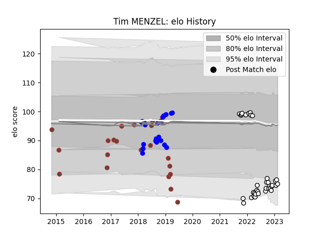

---  
layout: page  
title: Tim MENZEL  
date: 2023-01-27 19:00:33.880417  
categories: player  
---
# Tim MENZEL

## Positions: SH

## Country: Germany

## Current elo: 82.0

## Current Percentile: 17.0

# Elo History

# Match History

| Team                       |   Appearances |   Win Rate |
|:---------------------------|--------------:|-----------:|
| Valence Romans Drome Rugby |            31 |   0.677419 |
| Vannes                     |            24 |   0.583333 |
| Germany                    |            17 |   0.352941 |

| Opponent                   |   Matches |   Win Rate |
|:---------------------------|----------:|-----------:|
| Albi                       |         3 |   0.333333 |
| Soyaux-Angouleme           |         3 |   0.333333 |
| Nevers                     |         3 |   0.666667 |
| Brazil                     |         3 |   1        |
| Blagnac                    |         3 |   0.666667 |
| Dax                        |         3 |   0.333333 |
| Suresnes                   |         3 |   1        |
| Tarbes                     |         3 |   0.666667 |
| Samoa                      |         2 |   0        |
| Kenya                      |         2 |   1        |
| Rennes                     |         2 |   1        |
| Provence Rugby             |         2 |   0.5      |
| Nice                       |         2 |   1        |
| US Bressane                |         2 |   0.5      |
| Narbonne                   |         2 |   1        |
| Aubenas                    |         2 |   1        |
| Romania                    |         2 |   0        |
| Massy                      |         2 |   0.5      |
| Colomiers                  |         2 |   1        |
| Aurillac                   |         2 |   0.5      |
| Carcassonne                |         2 |   0.5      |
| Biarritz Olympique         |         2 |   0.5      |
| Dijon                      |         2 |   0.5      |
| Georgia                    |         1 |   0        |
| Brive                      |         1 |   0        |
| Bayonne                    |         1 |   0        |
| Belgium                    |         1 |   0        |
| Spain                      |         1 |   0        |
| Beziers                    |         1 |   1        |
| Russia                     |         1 |   0        |
| Bourgoin-Jallieu           |         1 |   1        |
| Portugal                   |         1 |   0        |
| Canada                     |         1 |   0        |
| Perpignan                  |         1 |   0        |
| Oyonnax                    |         1 |   0        |
| Carqueiranne-Hyères        |         1 |   1        |
| Cognac Saint Jean d'Angély |         1 |   1        |
| Namibia                    |         1 |   0        |
| Montauban                  |         1 |   1        |
| Mont-de-Marsan             |         1 |   1        |
| Uruguay                    |         1 |   1        |