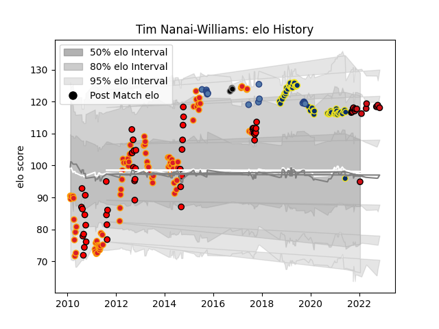

---  
layout: page  
title: Tim Nanai-Williams  
date: 2023-03-27 11:35:21.700888  
categories: player  
---
# Tim Nanai-Williams

Last updated: 2023-03-27
## Positions: FB, W

## Country: Samoa

## Current elo: 95.0

## Current Percentile: 86.0

# Elo History

# Match History

| Team              |   Appearances |   Win Rate |
|:------------------|--------------:|-----------:|
| Chiefs            |            86 |   0.552326 |
| Clermont Auvergne |            55 |   0.636364 |
| Counties Manukau  |            45 |   0.544444 |
| Stade Toulousain  |            17 |   0.676471 |
| Samoa             |            16 |   0.1875   |
| Black Rams Tokyo  |             3 |   0.333333 |

| Opponent                 |   Matches |   Win Rate |
|:-------------------------|----------:|-----------:|
| Highlanders              |        13 |   0.538462 |
| Crusaders                |        11 |   0.363636 |
| Hurricanes               |         9 |   0.5      |
| Blues                    |         9 |   0.722222 |
| Pau                      |         6 |   0.833333 |
| Stormers                 |         6 |   0.666667 |
| Bordeaux Begles          |         6 |   0.25     |
| La Rochelle              |         6 |   0.666667 |
| New South Wales Waratahs |         5 |   0.2      |
| Auckland                 |         5 |   0.4      |
| Lyon                     |         5 |   0.6      |
| Brumbies                 |         5 |   0.2      |
| Toulon                   |         5 |   0.4      |
| Waikato                  |         5 |   0        |
| Stade Francais Paris     |         5 |   0.9      |
| Northland                |         4 |   1        |
| Melbourne Rebels         |         4 |   0.75     |
| Manawatu                 |         4 |   0.75     |
| Agen                     |         4 |   1        |
| Otago                    |         4 |   1        |
| Perpignan                |         4 |   0.75     |
| Racing 92                |         4 |   0.375    |
| Sharks                   |         4 |   1        |
| Southland                |         4 |   0.75     |
| Stade Toulousain         |         4 |   0.125    |
| Tasman                   |         4 |   0.75     |
| Scotland                 |         4 |   0        |
| Montpellier Herault      |         4 |   0.5      |
| Western Force            |         4 |   0.75     |
| Bulls                    |         4 |   0.375    |
| Hawke's Bay              |         4 |   0.25     |
| Cheetahs                 |         4 |   0.75     |
| North Harbour            |         3 |   0.666667 |
| Castres Olympique        |         3 |   0.666667 |
| Queensland Reds          |         3 |   0.333333 |
| Lions                    |         3 |   1        |
| Northampton Saints       |         2 |   1        |
| Japan                    |         2 |   0        |
| Wellington               |         2 |   1        |
| United States of America |         2 |   1        |
| Bay of Plenty            |         2 |   0.25     |
| Timisoara Saracens       |         2 |   1        |
| Bayonne                  |         2 |   0.5      |
| Taranaki                 |         2 |   0        |
| Brive                    |         2 |   1        |
| Canterbury               |         2 |   0        |
| New Zealand              |         2 |   0        |
| Grenoble                 |         2 |   0.75     |
| Clermont Auvergne        |         2 |   1        |
| Wasps                    |         1 |   0        |
| Australia                |         1 |   0        |
| England                  |         1 |   0        |
| Ulster                   |         1 |   1        |
| Tokyo Sungoliath         |         1 |   0        |
| Ireland                  |         1 |   0        |
| Kobelco Kobe Steelers    |         1 |   0        |
| Romania                  |         1 |   0        |
| Biarritz Olympique       |         1 |   1        |
| British and Irish Lions  |         1 |   0        |
| Hanazono Kintetsu Liners |         1 |   1        |
| Russia                   |         1 |   1        |
| Southern Kings           |         1 |   1        |
| South Africa             |         1 |   0        |
| Harlequins               |         1 |   1        |