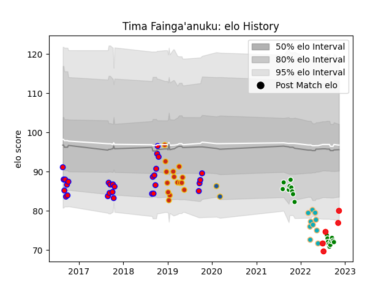

---  
layout: page  
title: Tima Fainga'anuku  
date: 2022-11-16 11:33:04.534262  
categories: player  
---
# Tima Fainga'anuku

## Positions: W

## Country: Tonga

## Current elo: 80.0

## Current Percentile: 4.0

# Elo History

# Match History

| Team           |   Appearances |   Win Rate |
|:---------------|--------------:|-----------:|
| Tasman         |            29 |   0.793103 |
| Manawatu       |            19 |   0.210526 |
| Perpignan      |            15 |   0.133333 |
| Moana Pasifika |            10 |   0.1      |
| Tonga          |             5 |   0.6      |
| Highlanders    |             2 |   0        |

| Opponent                 |   Matches |   Win Rate |
|:-------------------------|----------:|-----------:|
| Otago                    |         6 |   0.5      |
| Counties Manukau         |         5 |   0.6      |
| Auckland                 |         5 |   0.6      |
| Hawke's Bay              |         5 |   0.6      |
| Taranaki                 |         5 |   0.6      |
| North Harbour            |         4 |   0.75     |
| Canterbury               |         4 |   0        |
| Waikato                  |         4 |   0.75     |
| Northland                |         3 |   0.666667 |
| Wellington               |         3 |   0.666667 |
| Connacht                 |         2 |   0        |
| Clermont Auvergne        |         2 |   0        |
| Chiefs                   |         2 |   0        |
| Racing 92                |         2 |   0        |
| Bordeaux Begles          |         2 |   0        |
| Southland                |         2 |   1        |
| Hurricanes               |         2 |   0.5      |
| Sale Sharks              |         1 |   0        |
| Agen                     |         1 |   0        |
| Samoa                    |         1 |   0        |
| Sharks                   |         1 |   0        |
| Spain                    |         1 |   1        |
| Tasman                   |         1 |   0        |
| Stade Francais Paris     |         1 |   0        |
| Lyon                     |         1 |   0        |
| New South Wales Waratahs |         1 |   0        |
| Montpellier Herault      |         1 |   1        |
| Melbourne Rebels         |         1 |   0        |
| Manawatu                 |         1 |   0        |
| La Rochelle              |         1 |   0        |
| Hong Kong                |         1 |   1        |
| Highlanders              |         1 |   0        |
| Grenoble                 |         1 |   1        |
| Fijian Drua              |         1 |   0        |
| Fiji                     |         1 |   0        |
| Crusaders                |         1 |   0        |
| Chile                    |         1 |   1        |
| Bulls                    |         1 |   0        |
| Western Force            |         1 |   0        |