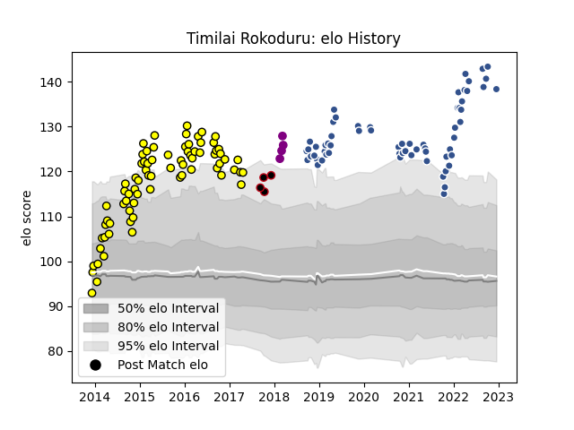

---  
layout: page  
title: Timilai Rokoduru  
date: 2023-02-04 18:31:03.605834  
categories: player  
---
# Timilai Rokoduru

## Positions: W

## Current elo: 85.0

## Current Percentile: 99.0

# Elo History

# Match History

| Team             |   Appearances |   Win Rate |
|:-----------------|--------------:|-----------:|
| Albi             |            78 |   0.474359 |
| Agen             |            66 |   0.333333 |
| Lyon             |             4 |   0.25     |
| Soyaux-Angouleme |             4 |   0.75     |

| Opponent             |   Matches |   Win Rate |
|:---------------------|----------:|-----------:|
| Carcassonne          |         9 |   0.611111 |
| Aurillac             |         8 |   0.5      |
| Montauban            |         7 |   0.285714 |
| Mont-de-Marsan       |         7 |   0        |
| Grenoble             |         7 |   0.5      |
| Colomiers            |         7 |   0.928571 |
| Narbonne             |         6 |   0.5      |
| Dax                  |         6 |   0.916667 |
| Lyon                 |         6 |   0.166667 |
| Beziers              |         6 |   0.25     |
| Perpignan            |         5 |   0.6      |
| Pau                  |         5 |   0        |
| Biarritz Olympique   |         5 |   0.6      |
| Bayonne              |         5 |   0.3      |
| Tarbes               |         4 |   0.75     |
| Toulon               |         4 |   0.25     |
| Provence Rugby       |         4 |   0.5      |
| Vannes               |         4 |   0.25     |
| Stade Francais Paris |         4 |   0        |
| Agen                 |         4 |   0.5      |
| Bourgoin-Jallieu     |         4 |   1        |
| La Rochelle          |         3 |   0.333333 |
| Montpellier Herault  |         3 |   0        |
| Oyonnax              |         3 |   0        |
| Stade Toulousain     |         3 |   0        |
| US Bressane          |         2 |   0.5      |
| Nevers               |         2 |   0.5      |
| Clermont Auvergne    |         2 |   0        |
| Castres Olympique    |         2 |   0        |
| Massy                |         2 |   1        |
| Bordeaux Begles      |         2 |   0        |
| Rouen                |         2 |   1        |
| Brive                |         2 |   0.5      |
| Auch                 |         1 |   1        |
| Benetton Treviso     |         1 |   1        |
| Cardiff Blues        |         1 |   0        |
| Racing 92            |         1 |   0        |
| Edinburgh            |         1 |   0        |
| London Irish         |         1 |   0        |
| Wasps                |         1 |   0        |