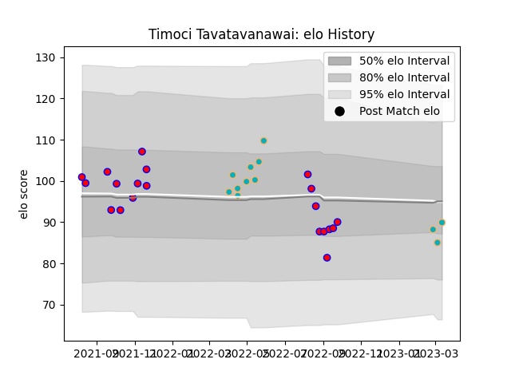

---  
layout: page  
title: Timoci Tavatavanawai  
date: 2023-03-17 17:24:32.746017  
categories: player  
---
# Timoci Tavatavanawai

## Positions: W

## Current elo: 90.0

## Current Percentile: 20.0

# Elo History

# Match History

| Team           |   Appearances |   Win Rate |
|:---------------|--------------:|-----------:|
| Tasman         |            20 |  0.5       |
| Moana Pasifika |            12 |  0.0833333 |

| Opponent                 |   Matches |   Win Rate |
|:-------------------------|----------:|-----------:|
| Waikato                  |         3 |        0   |
| Chiefs                   |         3 |        0   |
| Auckland                 |         2 |        0.5 |
| Northland                |         2 |        1   |
| Wellington               |         2 |        0.5 |
| Canterbury               |         2 |        0   |
| Fijian Drua              |         2 |        0   |
| Hawke's Bay              |         2 |        0.5 |
| Southland                |         2 |        1   |
| Taranaki                 |         1 |        1   |
| Queensland Reds          |         1 |        0   |
| Otago                    |         1 |        0   |
| Melbourne Rebels         |         1 |        0   |
| North Harbour            |         1 |        0   |
| New South Wales Waratahs |         1 |        0   |
| Bay of Plenty            |         1 |        1   |
| Manawatu                 |         1 |        1   |
| Highlanders              |         1 |        0   |
| Brumbies                 |         1 |        1   |
| Blues                    |         1 |        0   |
| Western Force            |         1 |        0   |