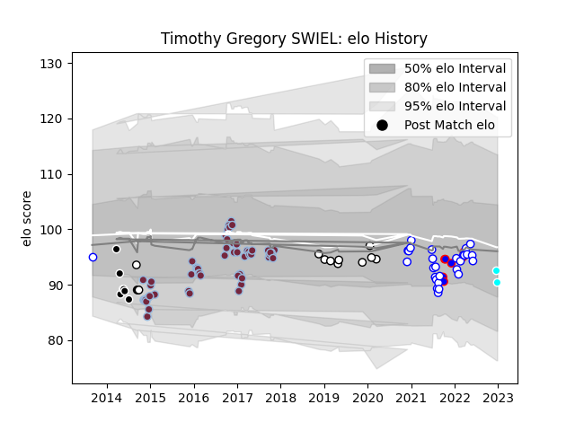

---  
layout: page  
title: Timothy Gregory SWIEL  
date: 2023-02-04 18:31:01.469312  
categories: player  
---
# Timothy Gregory SWIEL

## Positions: FH, FB

## Current elo: 88.0

## Current Percentile: 23.0

# Elo History

# Match History

| Team                             |   Appearances |   Win Rate |
|:---------------------------------|--------------:|-----------:|
| Harlequins                       |            57 |   0.508772 |
| Western Province                 |            30 |   0.366667 |
| Newcastle Falcons                |             9 |   0.444444 |
| Sharks                           |             7 |   0.428571 |
| Stormers                         |             7 |   0.5      |
| Natal Sharks                     |             4 |   0.625    |
| Toyota Industries Shuttles Aichi |             4 |   0.75     |

| Opponent               |   Matches |   Win Rate |
|:-----------------------|----------:|-----------:|
| Northampton Saints     |         6 |   0.166667 |
| Blue Bulls             |         6 |   0.166667 |
| Griquas                |         6 |   0.166667 |
| Golden Lions           |         6 |   0.416667 |
| Gloucester Rugby       |         6 |   0.5      |
| Free State Cheetahs    |         6 |   0.416667 |
| Wasps                  |         5 |   0.4      |
| Pumas                  |         5 |   0.7      |
| Newcastle Falcons      |         4 |   0.5      |
| Natal Sharks           |         4 |   0.5      |
| Worcester Warriors     |         4 |   0.75     |
| Leicester Tigers       |         4 |   0.5      |
| Sale Sharks            |         4 |   0.5      |
| Saracens               |         4 |   0.5      |
| Exeter Chiefs          |         4 |   0        |
| Edinburgh              |         3 |   0.166667 |
| Dragons                |         2 |   1        |
| Stade Francais Paris   |         2 |   0.5      |
| Cheetahs               |         2 |   0.5      |
| Harlequins             |         2 |   0        |
| Cardiff Blues          |         2 |   1        |
| Calvisano              |         2 |   1        |
| Bath Rugby             |         2 |   0.5      |
| Timisoara Saracens     |         2 |   1        |
| Leinster               |         2 |   0.5      |
| Shimizu Blue Sharks    |         1 |   1        |
| Stormers               |         1 |   0        |
| Urayasu D-Rocks        |         1 |   0        |
| Ospreys                |         1 |   1        |
| Yorkshire Carnegie     |         1 |   1        |
| Ampthill               |         1 |   1        |
| Kamaishi Seawaves      |         1 |   1        |
| Munster                |         1 |   0        |
| Montpellier Herault    |         1 |   0        |
| London Welsh           |         1 |   1        |
| Lions                  |         1 |   0        |
| La Rochelle            |         1 |   0        |
| Hino Red Dolphins      |         1 |   1        |
| Highlanders            |         1 |   0        |
| Eastern Province Kings |         1 |   1        |
| Crusaders              |         1 |   1        |
| Coventry               |         1 |   1        |
| Bulls                  |         1 |   0        |
| Bristol Rugby          |         1 |   1        |
| Blues                  |         1 |   1        |
| Benetton Treviso       |         1 |   0        |
| Bedford                |         1 |   1        |
| Zebre                  |         1 |   1        |