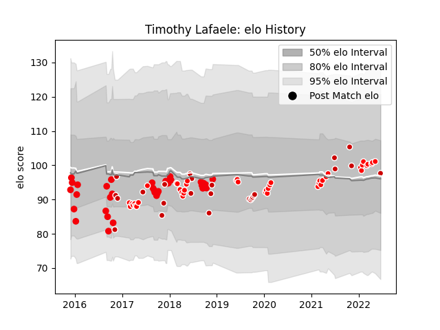

---  
layout: page  
title: Timothy Lafaele  
date: 2023-01-13 11:27:34.976866  
categories: player  
---
# Timothy Lafaele

## Positions: C

## Country: Japan

## Current elo: 108.0

## Current Percentile: 77.0

# Elo History

# Match History

| Team                  |   Appearances |   Win Rate |
|:----------------------|--------------:|-----------:|
| Coca-Cola Red Sparks  |            27 |   0.037037 |
| Japan                 |            25 |   0.46     |
| Kobelco Kobe Steelers |            22 |   0.818182 |
| Sunwolves             |            21 |   0.190476 |

| Opponent                          |   Matches |   Win Rate |
|:----------------------------------|----------:|-----------:|
| Yokohama Canon Eagles             |         7 |   0.285714 |
| Saitama Wild Knights              |         5 |   0        |
| Green Rockets Tokatsu             |         5 |   0.8      |
| Shizuoka Blue Revs                |         5 |   0.4      |
| Black Rams Tokyo                  |         5 |   0.6      |
| Toshiba Brave Lupus Tokyo         |         3 |   0.333333 |
| Stormers                          |         3 |   0.333333 |
| Ireland                           |         3 |   0.333333 |
| Toyota Verblitz                   |         2 |   0        |
| Tokyo Sungoliath                  |         2 |   0.5      |
| South Africa                      |         2 |   0        |
| Italy                             |         2 |   0.5      |
| Urayasu D-Rocks                   |         2 |   0.5      |
| Russia                            |         2 |   1        |
| Munakata Sanix Blues              |         2 |   0        |
| Australia                         |         2 |   0        |
| Kubota Spears Funabashi Tokyo-Bay |         2 |   0.5      |
| Kobelco Kobe Steelers             |         2 |   0        |
| Jaguares                          |         2 |   0        |
| Mie Honda Heat                    |         2 |   0.5      |
| Hurricanes                        |         2 |   0        |
| Hanazono Kintetsu Liners          |         2 |   0.5      |
| Georgia                           |         2 |   1        |
| Blues                             |         2 |   0.5      |
| Brumbies                          |         2 |   0        |
| Bulls                             |         2 |   0.5      |
| Crusaders                         |         2 |   0        |
| England                           |         1 |   0        |
| Wales                             |         1 |   0        |
| Uruguay                           |         1 |   1        |
| British and Irish Lions           |         1 |   0        |
| Toyota Industries Shuttles Aichi  |         1 |   0        |
| Tonga                             |         1 |   1        |
| Chiefs                            |         1 |   0        |
| Southern Kings                    |         1 |   0        |
| Scotland                          |         1 |   1        |
| Hino Red Dolphins                 |         1 |   1        |
| Samoa                             |         1 |   1        |
| Fiji                              |         1 |   0        |
| France                            |         1 |   0.5      |
| Romania                           |         1 |   1        |
| Queensland Reds                   |         1 |   1        |
| New Zealand                       |         1 |   0        |
| New South Wales Waratahs          |         1 |   0        |
| NTT Docomo Red Hurricanes Osaka   |         1 |   1        |
| Melbourne Rebels                  |         1 |   0        |
| Highlanders                       |         1 |   0        |
| Argentina                         |         1 |   0        |