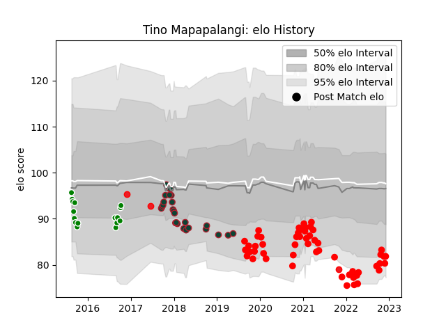

---  
layout: page  
title: Tino Mapapalangi  
date: 2022-12-09 13:09:41.568913  
categories: player  
---
# Tino Mapapalangi

## Positions: N8, FL

## Country: Tonga

## Current elo: 82.0

## Current Percentile: 7.0

# Elo History

# Match History

| Team             |   Appearances |   Win Rate |
|:-----------------|--------------:|-----------:|
| Rouen            |            53 |   0.40566  |
| Leicester Tigers |            26 |   0.538462 |
| Manawatu         |            16 |   0.3125   |
| Tonga            |             3 |   0.333333 |

| Opponent                   |   Matches |   Win Rate |
|:---------------------------|----------:|-----------:|
| Aurillac                   |         6 |   0.333333 |
| Provence Rugby             |         5 |   0.5      |
| Soyaux-Angouleme           |         4 |   0.75     |
| Montauban                  |         4 |   0.5      |
| Mont-de-Marsan             |         4 |   0.25     |
| Grenoble                   |         4 |   0.5      |
| Sale Sharks                |         3 |   1        |
| Colomiers                  |         3 |   0        |
| Oyonnax                    |         3 |   0.333333 |
| Nevers                     |         3 |   0.333333 |
| Exeter Chiefs              |         3 |   0.333333 |
| Carcassonne                |         3 |   0        |
| Biarritz Olympique         |         3 |   0.333333 |
| Beziers                    |         3 |   0.333333 |
| Castres Olympique          |         2 |   0.5      |
| Waikato                    |         2 |   0        |
| Northland                  |         2 |   1        |
| Vannes                     |         2 |   1        |
| Southland                  |         2 |   0.5      |
| Perpignan                  |         2 |   1        |
| London Irish               |         2 |   1        |
| Wasps                      |         2 |   0.5      |
| Munster                    |         2 |   0        |
| Wellington                 |         2 |   1        |
| Bath Rugby                 |         2 |   0.5      |
| Northampton Saints         |         2 |   0.5      |
| Scotland                   |         1 |   0        |
| Agen                       |         1 |   0        |
| Taranaki                   |         1 |   0        |
| Tasman                     |         1 |   0        |
| Scarlets                   |         1 |   0        |
| Valence Romans Drome Rugby |         1 |   0        |
| Wales                      |         1 |   0        |
| US Bressane                |         1 |   0        |
| Newcastle Falcons          |         1 |   1        |
| Saracens                   |         1 |   0        |
| Roval Drome XV             |         1 |   1        |
| Racing 92                  |         1 |   0        |
| North Harbour              |         1 |   0        |
| Auckland                   |         1 |   0        |
| Italy                      |         1 |   1        |
| Hawke's Bay                |         1 |   0        |
| Harlequins                 |         1 |   1        |
| Gloucester Rugby           |         1 |   1        |
| Counties Manukau           |         1 |   0        |
| Cardiff Blues              |         1 |   1        |
| Canterbury                 |         1 |   0        |
| Bay of Plenty              |         1 |   0        |
| Worcester Warriors         |         1 |   0        |