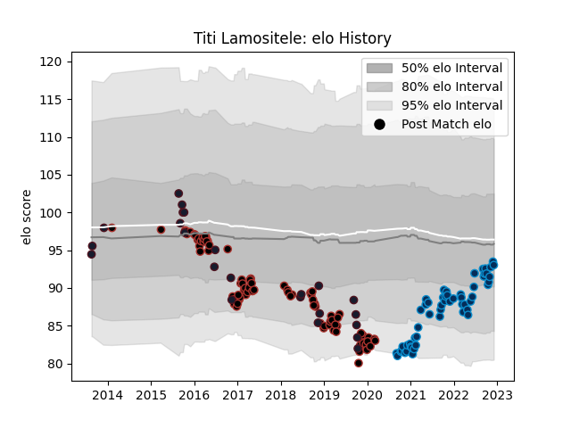

---  
layout: page  
title: Titi Lamositele  
date: 2022-11-15 23:35:40.677638  
categories: player  
---
# Titi Lamositele

## Positions: P

## Country: United States of America

## Current elo: 93.0

## Current Percentile: 29.0

# Elo History

# Match History

| Team                     |   Appearances |   Win Rate |
|:-------------------------|--------------:|-----------:|
| Saracens                 |            88 |   0.744318 |
| Montpellier Herault      |            53 |   0.537736 |
| United States of America |            23 |   0.347826 |

| Opponent             |   Matches |   Win Rate |
|:---------------------|----------:|-----------:|
| Leicester Tigers     |         9 |   0.666667 |
| Northampton Saints   |         7 |   0.714286 |
| Bath Rugby           |         7 |   0.714286 |
| Racing 92            |         7 |   0.428571 |
| Harlequins           |         7 |   0.714286 |
| Exeter Chiefs        |         7 |   0.5      |
| Wasps                |         6 |   0.666667 |
| Toulon               |         6 |   0.75     |
| Gloucester Rugby     |         6 |   0.833333 |
| Clermont Auvergne    |         5 |   0.6      |
| Sale Sharks          |         5 |   0.7      |
| Worcester Warriors   |         5 |   0.8      |
| Castres Olympique    |         5 |   0.4      |
| Canada               |         5 |   0.6      |
| Stade Toulousain     |         5 |   0.2      |
| Bordeaux Begles      |         5 |   0.4      |
| Stade Francais Paris |         4 |   1        |
| Lyon                 |         4 |   0.5      |
| Brive                |         4 |   0.75     |
| Newcastle Falcons    |         4 |   1        |
| Bristol Rugby        |         4 |   0.75     |
| La Rochelle          |         4 |   0.5      |
| Pau                  |         3 |   0.333333 |
| Glasgow Warriors     |         3 |   1        |
| Munster              |         3 |   0.666667 |
| London Irish         |         3 |   1        |
| Russia               |         2 |   1        |
| Romania              |         2 |   0.5      |
| Scotland             |         2 |   0.5      |
| Samoa                |         2 |   0.5      |
| Scarlets             |         2 |   0.75     |
| Agen                 |         2 |   1        |
| Ospreys              |         2 |   1        |
| Bayonne              |         2 |   0.5      |
| Leinster             |         2 |   0.5      |
| Perpignan            |         1 |   1        |
| New Zealand Maori    |         1 |   0        |
| Argentina            |         1 |   0        |
| Japan                |         1 |   0        |
| Italy                |         1 |   0        |
| Ireland              |         1 |   0        |
| France               |         1 |   0        |
| England              |         1 |   0        |
| South Africa         |         1 |   0        |
| Dragons              |         1 |   1        |
| Biarritz Olympique   |         1 |   1        |
| Tonga                |         1 |   0        |
| Australia            |         1 |   0        |