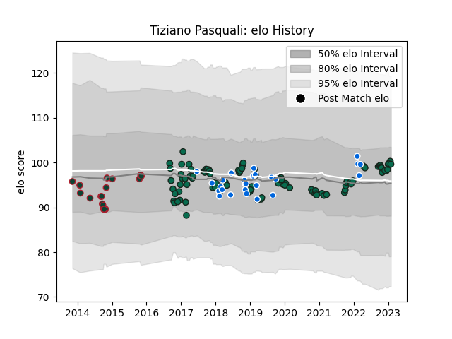

---  
layout: page  
title: Tiziano Pasquali  
date: 2022-12-18 16:22:59.242495  
categories: player  
---
# Tiziano Pasquali

## Positions: P

## Country: Italy

## Current elo: 99.0

## Current Percentile: 63.0

# Elo History

# Match History

| Team             |   Appearances |   Win Rate |
|:-----------------|--------------:|-----------:|
| Benetton Treviso |           101 |   0.386139 |
| Italy            |            25 |   0.16     |
| Leicester Tigers |            18 |   0.611111 |

| Opponent             |   Matches |   Win Rate |
|:---------------------|----------:|-----------:|
| Scarlets             |        12 |   0.166667 |
| Edinburgh            |        10 |   0.6      |
| Zebre                |         8 |   0.875    |
| Glasgow Warriors     |         8 |   0.375    |
| Ospreys              |         6 |   0.5      |
| Leinster             |         6 |   0.166667 |
| Munster              |         6 |   0        |
| Dragons              |         6 |   0.666667 |
| Ulster               |         5 |   0.2      |
| Cardiff Blues        |         5 |   0.2      |
| Bath Rugby           |         4 |   0.25     |
| Connacht             |         4 |   0        |
| Ireland              |         4 |   0        |
| Southern Kings       |         4 |   1        |
| France               |         4 |   0        |
| Harlequins           |         3 |   0.666667 |
| Scotland             |         3 |   0        |
| Gloucester Rugby     |         3 |   0        |
| London Irish         |         3 |   0.666667 |
| England              |         3 |   0        |
| Northampton Saints   |         2 |   0        |
| Toulon               |         2 |   0        |
| Wales                |         2 |   0        |
| Lyon                 |         2 |   0.5      |
| Agen                 |         2 |   0.5      |
| Bayonne              |         2 |   1        |
| Bulls                |         2 |   0        |
| Japan                |         2 |   0.5      |
| Grenoble             |         2 |   1        |
| La Rochelle          |         2 |   0        |
| Exeter Chiefs        |         2 |   0.5      |
| Australia            |         1 |   0        |
| South Africa         |         1 |   0        |
| Wasps                |         1 |   1        |
| Cheetahs             |         1 |   1        |
| Stormers             |         1 |   1        |
| Stade Francais Paris |         1 |   0        |
| Georgia              |         1 |   1        |
| Fiji                 |         1 |   0        |
| Saracens             |         1 |   1        |
| Sale Sharks          |         1 |   1        |
| Russia               |         1 |   1        |
| Newcastle Falcons    |         1 |   1        |
| New Zealand          |         1 |   0        |
| Namibia              |         1 |   1        |
| Lions                |         1 |   0        |