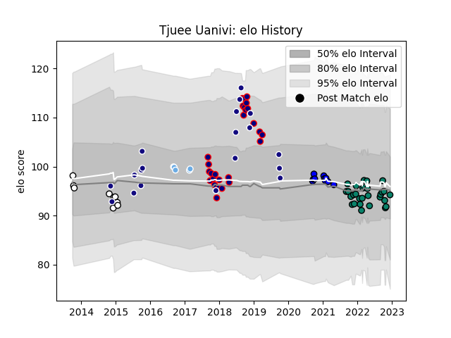

---  
layout: page  
title: Tjuee Uanivi  
date: 2022-12-18 16:18:42.728803  
categories: player  
---
# Tjuee Uanivi

## Positions: L, FL

## Country: Namibia

## Current elo: 95.0

## Current Percentile: 45.0

# Elo History

# Match History

| Team             |   Appearances |   Win Rate |
|:-----------------|--------------:|-----------:|
| Montauban        |            30 |   0.383333 |
| London Scottish  |            27 |   0.351852 |
| Namibia          |            19 |   0.421053 |
| Massy            |            10 |   0.55     |
| Brive            |             9 |   0.333333 |
| Glasgow Warriors |             5 |   0.4      |

| Opponent            |   Matches |   Win Rate |
|:--------------------|----------:|-----------:|
| Oyonnax             |         5 |   0.4      |
| Nottingham          |         3 |   0.333333 |
| Aurillac            |         3 |   0.333333 |
| Provence Rugby      |         3 |   0        |
| Bedford             |         3 |   0.5      |
| Beziers             |         3 |   0.333333 |
| Richmond            |         3 |   0.333333 |
| Ealing Trailfinders |         3 |   0        |
| Grenoble            |         3 |   0.166667 |
| Carcassonne         |         3 |   0.333333 |
| Jersey              |         2 |   0.5      |
| Tarbes              |         2 |   0.5      |
| Mont-de-Marsan      |         2 |   1        |
| London Irish        |         2 |   0        |
| Russia              |         2 |   1        |
| Coventry            |         2 |   0.5      |
| New Zealand         |         2 |   0        |
| Nevers              |         2 |   1        |
| Doncaster           |         2 |   0        |
| Cornish Pirates     |         2 |   0.5      |
| Ulster              |         2 |   0        |
| Aubenas             |         2 |   1        |
| Bayonne             |         2 |   0        |
| Zebre               |         2 |   0        |
| Blagnac             |         2 |   0.5      |
| Yorkshire Carnegie  |         2 |   1        |
| Portugal            |         2 |   0.5      |
| Chambery            |         2 |   0.25     |
| Soyaux-Angouleme    |         1 |   1        |
| South Africa        |         1 |   0        |
| US Bressane         |         1 |   0.5      |
| Vannes              |         1 |   0        |
| Rouen               |         1 |   1        |
| Rotherham Titans    |         1 |   1        |
| Spain               |         1 |   0        |
| Uganda              |         1 |   1        |
| Tonga               |         1 |   0        |
| Tunisia             |         1 |   1        |
| Uruguay             |         1 |   0        |
| Agen                |         1 |   0        |
| Ospreys             |         1 |   0        |
| Nice                |         1 |   0        |
| Biarritz Olympique  |         1 |   0        |
| Bourgoin-Jallieu    |         1 |   1        |
| Bristol Rugby       |         1 |   0        |
| Calvisano           |         1 |   0.5      |
| Canada              |         1 |   0        |
| Colomiers           |         1 |   0        |
| Connacht            |         1 |   1        |
| Georgia             |         1 |   0        |
| Gloucester Rugby    |         1 |   0        |
| Hartpury College    |         1 |   0        |
| Italy               |         1 |   0        |
| Kenya               |         1 |   1        |
| Leinster            |         1 |   1        |
| Argentina           |         1 |   0        |
| Morocco             |         1 |   1        |
| Narbonne            |         1 |   1        |
| Newcastle Falcons   |         1 |   1        |
| Zimbabwe            |         1 |   1        |