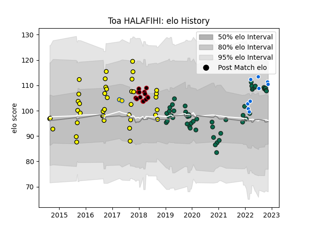

---  
layout: page  
title: Toa HALAFIHI  
date: 2023-02-24 02:35:21.333750  
categories: player  
---
# Toa HALAFIHI

## Positions: N8

## Country: Italy

## Current elo: 110.0

## Current Percentile: 76.0

# Elo History

# Match History

| Team             |   Appearances |   Win Rate |
|:-----------------|--------------:|-----------:|
| Benetton Treviso |            50 |   0.42     |
| Taranaki         |            39 |   0.628205 |
| Lyon             |            14 |   0.357143 |
| Italy            |             9 |   0.444444 |
| Hurricanes       |             2 |   0.5      |

| Opponent                 |   Matches |   Win Rate |
|:-------------------------|----------:|-----------:|
| Leinster                 |         7 |  0.0714286 |
| Tasman                   |         6 |  0.166667  |
| Zebre                    |         5 |  0.8       |
| Bay of Plenty            |         5 |  0.8       |
| Connacht                 |         4 |  0         |
| Waikato                  |         4 |  0.625     |
| Munster                  |         4 |  0         |
| Edinburgh                |         4 |  0.5       |
| Dragons                  |         4 |  1         |
| Manawatu                 |         4 |  1         |
| Cardiff Blues            |         4 |  0.25      |
| Canterbury               |         4 |  0.5       |
| Montpellier Herault      |         3 |  0.333333  |
| Toulon                   |         3 |  0.333333  |
| Counties Manukau         |         3 |  1         |
| Wellington               |         3 |  0.666667  |
| Auckland                 |         3 |  0.666667  |
| Scarlets                 |         3 |  0.666667  |
| Hawke's Bay              |         3 |  0.666667  |
| Stade Francais Paris     |         2 |  1         |
| Northland                |         2 |  0.5       |
| Ulster                   |         2 |  0.25      |
| Glasgow Warriors         |         2 |  1         |
| Scotland                 |         1 |  0         |
| Sale Sharks              |         1 |  0         |
| Samoa                    |         1 |  1         |
| Romania                  |         1 |  1         |
| Racing 92                |         1 |  0         |
| Bordeaux Begles          |         1 |  0         |
| Southern Kings           |         1 |  1         |
| Southland                |         1 |  1         |
| Pau                      |         1 |  1         |
| Australia                |         1 |  1         |
| Wales                    |         1 |  1         |
| Perpignan                |         1 |  1         |
| Clermont Auvergne        |         1 |  0         |
| Oyonnax                  |         1 |  0         |
| La Rochelle              |         1 |  0         |
| Crusaders                |         1 |  0         |
| England                  |         1 |  0         |
| France                   |         1 |  0         |
| Georgia                  |         1 |  0         |
| Grenoble                 |         1 |  1         |
| Ireland                  |         1 |  0         |
| Bulls                    |         1 |  0         |
| Otago                    |         1 |  0         |
| Lyon                     |         1 |  0         |
| Brive                    |         1 |  1         |
| New South Wales Waratahs |         1 |  1         |
| Northampton Saints       |         1 |  0         |
| Castres Olympique        |         1 |  0         |
| Ospreys                  |         1 |  0         |
| Agen                     |         1 |  1         |