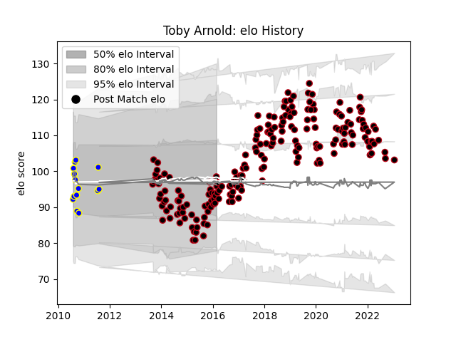

---  
layout: page  
title: Toby Arnold  
date: 2023-01-17 11:29:52.290677  
categories: player  
---
# Toby Arnold

## Positions: W, FB

## Current elo: 98.0

## Current Percentile: 38.0

# Elo History

# Match History

| Team          |   Appearances |   Win Rate |
|:--------------|--------------:|-----------:|
| Lyon          |           206 |   0.616505 |
| Bay of Plenty |            14 |   0.571429 |

| Opponent             |   Matches |   Win Rate |
|:---------------------|----------:|-----------:|
| Castres Olympique    |        13 |   0.307692 |
| Brive                |        13 |   0.653846 |
| Toulon               |        13 |   0.5      |
| Montpellier Herault  |        12 |   0.5      |
| Racing 92            |        12 |   0.583333 |
| Bordeaux Begles      |        12 |   0.416667 |
| Pau                  |        11 |   0.590909 |
| Clermont Auvergne    |        11 |   0.454545 |
| Stade Francais Paris |        11 |   0.727273 |
| La Rochelle          |        10 |   0.55     |
| Stade Toulousain     |        10 |   0.55     |
| Agen                 |         8 |   0.75     |
| Bayonne              |         6 |   0.916667 |
| Perpignan            |         6 |   0.833333 |
| Grenoble             |         4 |   0.75     |
| Mont-de-Marsan       |         4 |   1        |
| Biarritz Olympique   |         4 |   1        |
| Oyonnax              |         4 |   0.5      |
| Carcassonne          |         4 |   1        |
| Tarbes               |         3 |   0.666667 |
| Albi                 |         3 |   1        |
| Aurillac             |         3 |   0.666667 |
| Bourgoin-Jallieu     |         3 |   1        |
| Beziers              |         3 |   0.666667 |
| Colomiers            |         3 |   1        |
| Saracens             |         3 |   0        |
| Narbonne             |         3 |   0.666667 |
| Provence Rugby       |         2 |   1        |
| North Harbour        |         2 |   1        |
| Northland            |         2 |   0        |
| Leinster             |         2 |   0        |
| Dax                  |         2 |   1        |
| Counties Manukau     |         2 |   1        |
| Montauban            |         2 |   1        |
| Northampton Saints   |         1 |   0        |
| Canterbury           |         1 |   0        |
| US Bressane          |         1 |   1        |
| Auch                 |         1 |   1        |
| Auckland             |         1 |   0        |
| Taranaki             |         1 |   0        |
| Benetton Treviso     |         1 |   1        |
| Cardiff Blues        |         1 |   0        |
| Southland            |         1 |   1        |
| Glasgow Warriors     |         1 |   0        |
| Hawke's Bay          |         1 |   1        |
| Manawatu             |         1 |   1        |
| Otago                |         1 |   1        |
| Waikato              |         1 |   0        |